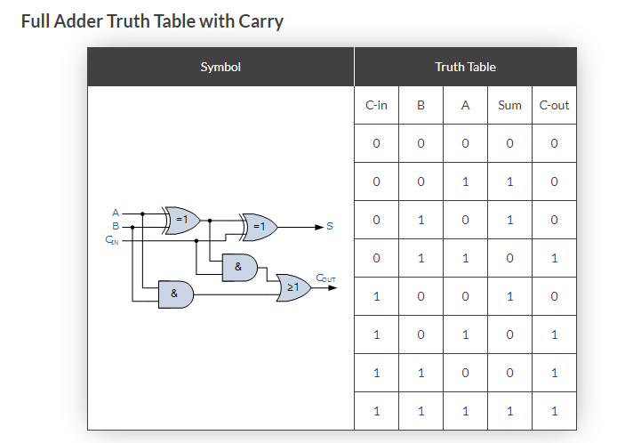

# Bit Programming

## Always enclose the bit operations in parenthesis, since they have low precidence.

## Basics
- [Deal with negative number](https://www.youtube.com/watch?v=lKTsv6iVxV4)
- A 4 bit 2's complement representation can go from 7 to -8.
- A 8 bit 2's complement can go from 127 to -128.
- [In a 4 bit 2's complement representation (C4^C3) C4-> Overflow of sign bit will determine overflow condition](https://www.youtube.com/watch?v=DKj8p2nfdA8)
- Multiplication by a number is same as in case of decimal numbers.
- ```~S``` is not 2's complement, it is ones's complement.
- ```~S + 1``` is 2's complement.

## Tips
- Multiplying by 2^n is just left shift by n.
- Dividing by 2^n is just right shift by n.
- Xoring a number by itself is zero.
- **Xoring a number by negative of itself is all ones.**
- To find the value of the LSB perform ```A&1```


## Problems

### XOR Problems
- Find minimum XOR value
  - The first step is to sort the array. The answer will be the minimal value of X[i] XOR X[i+1] for every i.
- Find single non-duplicate in an array
  - XOR all elements.


## Bits Concept

### To know the number of set bits in a number.
  - **Brian Kerighan's Algorithm** -> Subtraction of a number by 1 inverts all the bits(from right to left) till the rightmost set bit(including the rightmost set bit). So if we subtract a number by 1 and do a bitwise and with itself (n&(n-1)) we unset the rightmost bit. If we do **(n&(n-1)) in a loop** and count the number of times loop executes it gives the number of set bits.
  - Look Up approach. Uses Preprocessing to solve the program.
  - ```cout << __builtin_popcount (unsigned int n)```; -> builtin way to return the number of set bits.

### turnOffLastSetBit
- **Brian Kerighan's Algorithm**
- ```S & (S-1)```

### turnOnLastZero
- ```S | (S+1)```


### Find if a number is a power of 2.
  - If only one set bit then it is a power of 2.
  - #### Brian Kernighan's Method -> If a number is power of 2 (n&(n-1)) is 0. You however need to take care of 0 case. so ```return x&&(!(x&(x-1)))```.
  - Take log2 of the number if you get integer value it is power of 2.

### Get the right most set bit/ LSB
- ```(n & (-n))``` 

### Set the jth bit
- ```S|=(1<<j)```
  
### Check if a bit is set
- ```S&(1<<j)```

### Clear a bit if set
- ```S&=~(1<<j)```

### Toggle a bit
- ```S^=(1<<j)```

### Turn on all the bits in a set of size n.
- ```S = (1<<n) - 1```
- #### Be careful of overflows.

### turnOffLastConsecutiveBits
- ```((S) & (S+1))```

### turnOnLastConsecutiveZeroes
- ```((S) | (S-1))```


# For Bit questions it can be useful to know how to convert the truth table to logical circuit.

Say for instance we have to add 2 bits, with carry.
Truth Table Looks like.


Let us find the logical circuit for Carry Out. You need to just consider the cases where C-Out is 1, i.e A*B*(!C) + A*(!B)*C + A*B*C + (!A)*B*C = A*B + (A^B)*C 

Similarly you can do for any truth table.

# To Solve
- Single Number II
- Single Number III