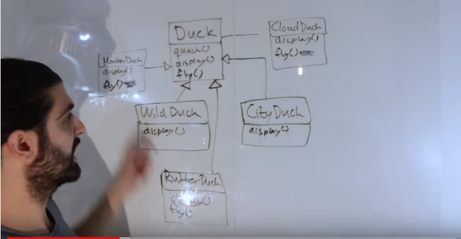
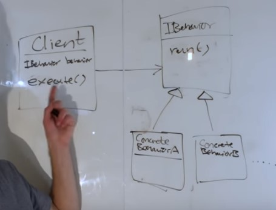
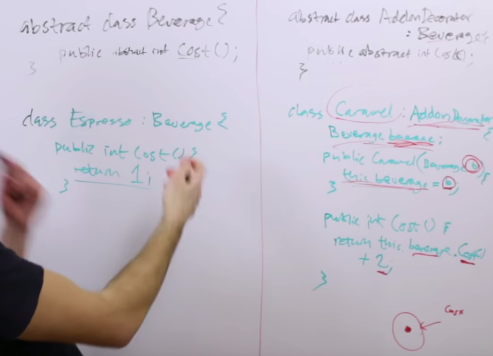
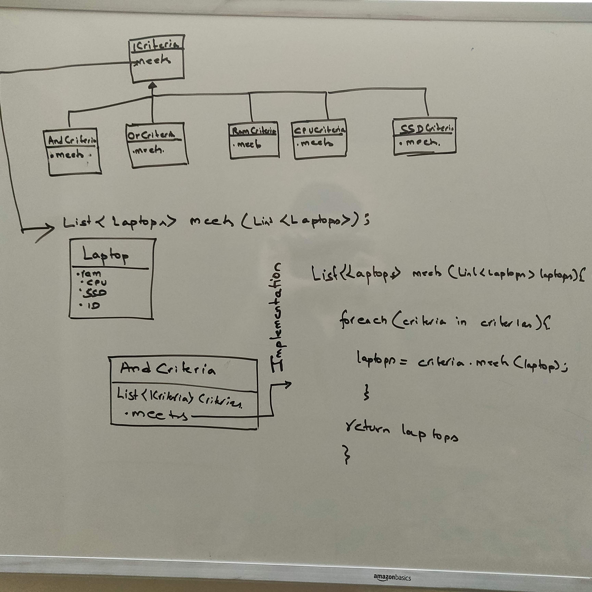

# UML
##  Connector types in UML
- 

# Design Patterns

## Strategy Pattern
- Defines a family of algorithms, encapsulates each one and makes them interchangable.

- It lets the algorithm vary independently from the client that use it.

- You have algorithms A, B, C used by some client class. With this strategy pattern you can plug and play it. Sometimes use A, B, C.

- Decoupled the algorithm from one using the algorithm(client).

- **Composition should be favored over inheritance as inheritance excepts each subclass to implements its own version of the methods and these subclasses can share the method implementation among themselves but if inheritance is used even if implementation is same we need to write duplicate code for each subclass thus inheritance is bad.**

- Mostly used to reduce the duplicacy as in above example.

- **Example** - If a list has a sorting algorithm built into it, you can never change the sorting algorithm. But if you use strategy pattern and inject a sorting algorithm you can use any sorting algorithm you want.

- If A knows how to use B because A knows the I interface that B implements then A can swap out B for C so long as C also implements I.

    A--(I)-->B can be easily changed to A--(I)-->C
     
The strategy pattern is about being able to change from one to the other at run time.

- **Duck Example** and each duck type can have different fly methods and quack and display method. Instead of creating new subclasses you can perform dependency injection by passing the concrete implementation of Strategy Interfaces at runtime. Instead of hard coding these concrete implementation for each class.

  - **Before Using Strategy Pattern**

  - **After Using Strategy Pattern**

  - **Dependency Injection Code**
  
- **General Strategy UML** 

## Observer Pattern

- Idea is to push rather than pull to Observers/subscribers listening on the Observable/Publisher.

- When we go to new state Observable Class is responsible to notify every Observer that it has changed.

- Suitable pattern for chatroom. When someone sends a message, all the clients connected to same chat room will get the message.

#### Observable Interface
- Methods in Observable 
    - register(IObserver)
    - unregister(IObserver) 
    - notify() -> Broadcasts the message to all the observers.(For loop all the observer and call update()/update(IObservable))

- Observable Interface also has a collection to contain observers, it can be vector, array, linkedlist, hashmap etc.

#### Observers Interface
 
- Methods in Observers
    - update() / update(IObservable) -> Invoked by Observable inside notify function. If observer has a reference to observable then first variation else second.

#### Important

- **A useful thing to add to concrete observer class is the reference to concrete observable class.** Doing above might feel strange as we are used to have dependecies between abstract interfaces and not concrete implementation of them. Here we have a concretion dependent on another concretion. **The idea behind this is when we instantiate the observer we pass the thing we want to observe in its constructor.** So it goes two ways the observer gets added to observable via add method and observable gets added to observer via the constructor. **Since the observer has a reference to observable, when we call update we don't need to pass anything to the update function since in a lot of cases to update we need to know what has changed.**
- The above however gives entire access of observable to each observer which can be considered a bad practise. Instead we can maybe pass in only the data that is required by the observer in the notify method -> update(IObservable dataWhichIsRequired).

- **Observer UML** 
  
   

## Decorator

- **Decorator pattern attaches additional responsibilities to an object dynamically(run-time)**.
    - Allows to change the behavior of a function/ code in runtime rather than compile time. 
    - Changing the behavior of method inside class without rewriting the method i.e without opening up the class and changing contents of file.


- Decorators provide a flexible alternative to subclassing thus helping with class explosion scenario.
  - We use inheritance so that decorator behaves as it was a component but we use composition to share behavior.
  - If we have subclass A, B and C, using inheritance alone we cannot have A and B at the same time at runtime but with decorators we can.
  
- Wrap the object in another object which behaves same as the wrapped object(component).

- **The decorator both has a component and is a component.**

- Coffee house (StarBuzz) - (not so good example but lets go on).
  
  - If we want 3-4 base line beverages like espresso, steamed milk cappacino etc. We also want addons like wipped cream, caramel, chocolate etc.
  - A naive approach would be to just have a class for each combination. This leads to serious class explosion.
  - Another approach can be treating each addon as a boolean, like hasCaramel, hasSoy etc. We can either have setters for them, or set them during initialization. This feels tedious and also there is a saying conditional breeds. This also leads problems when we try to add a flavour and then we need to change the source code for that. Also it can lead to violation of Integration Seggregation principle say tea cannot go with chocholate, by having above structure even tea class has hasChocholate method. Also what if a customer want double soy milk addon? We need to have a boolean for that too. This is messy.
  - Let us use decorator pattern for this. Say we have an abstract class Beverage (getDesc(), cost()) and 2 concrete class Decaf and Espresso. **We also have a AddonDecorator(getDesc(), cost()) which inherits Beverage. The AddonDecorator also has a beverage.** Then we have 2 concrete implementation of AddonDecorator say, SoyDecorator, WhippedCreamDecorator. 
  
  - 
  - The baseline classes/component can exist independently and implementation of cost method there will be say 
    ```
    int cost(){
        return 2;
    }
    ```
  - The decorator by itself cannot exist on its own and has to contain a baseline component.
    ```
    int cost(){
        return this.beverage.cost() + 1;
    }
    ```
  
  - The decorated class doesn't know if it is wrapping a baseline class or a decorated class.
  - This is similar to linked list. where we can recurse and get to the end node and return the value up the chain.
  - Code
  
  - To create an object we do->
    ```
    Beverage b = new WhippedCreamDecorator(new CaramelDecorator(new Espresso()));
    ```

  - This example is not very good for using decorator pattern. Reason -> It is unnecessarily complicated. Rather than using decorator pattern, we can just pass the flavours/ addon by passing a collection of addons as an array. It is unsuitable to use decorator pattern if the methods in each decorator only differs in the value(or a property) i.e cost of the decorator addon. It is used when the cost method is calculated differently for each decorator. Also mostly the decorator is not significantly different from the component but in this example an addon is different and is not a beverage.

- A better example to use is how java uses decorator to implement various streams, we have input stream which can be a file input stream and be decorated by buffered input stream or line number input stream. It makes sense here cause all these are input stream. The decorator has  a name that resemble the thing we are decorating. Secondly and more importantly the actual implementation for each decorator's method is very different and not just a difference in properties i.e instance variables.


 

 - In the above diagram we can see we are attaching additional responisbilities(the decorator class) to an object(component class) dynamically/at run-time.

- If you interested in order of how you wrap objects then decorator is not suitable.

## Builder Pattern
[Link](https://medium.com/@ajinkyabadve/builder-design-patterns-in-java-1ffb12648850)

## Filter Design Pattern
- Useful when designing the filtering system in E-Commerce websites, say you have a laptop shop, and would like to give users ability to filter the laptops based on variety of criterias, which can change in future, The most effective pattern for this is filter pattern.



The main method for this would look like
```c++
  void main(){
    List<Laptop> laptops = LaptopFactory.manufactureInBulk();
    ICriteria searchCriteria = new AndCriteria(new RamCriteria(4), new CPUCriteria("i5"), new SSDCriteria(128));
    List<Laptop> filteredLaptops = searchCriteria.meets(laptops);
  }

```
ref-> https://singhajit.com/filter-design-pattern/

## Singleton

A Singleton class can be implemented in 2 ways, lazy loading or eager loading.

### Lazy Loading (Singleton is initialized when the getInstance is called, not when class is first initialized.)
### 1. Static Class Singleton Holder (Best way for lazy)
  ```java
  public class Singleton {
    private static class LazyLoader {
        private static Singleton instance = new Singleton();
    }

    private Singleton() {
      //Prevent reflection from creating another instance
        if(_instance !=null) throw Exception();
    }

    public static Singleton getInstance() {
        return LazyLoader.instance;
    }
  }
  ```
This pattern is beneficial for at least 3 reasons:
  - Static factory
  - **Lazy initialization**
  - **Thread Safe** (the class initialization phase is guaranteed by the JLS (Java Language Specification) to be serial)

The JVM defers initializing the InstanceHolder class until it is actually used, and because the Singleton is initialized with a static initializer, no additional synchronization is needed. The first call to getInstance by any thread causes InstanceHolder to be loaded and initialized, at which time the initialization of the Singleton happens through the static initializer.

**Static holder pattern is also considered as the smartest replace for Double-check-locking antipattern.**

The implementation of the idiom relies on the initialization phase of execution within the Java Virtual Machine (JVM) as specified by the Java Language Specification (JLS). When the class Something is loaded by the JVM, the class goes through initialization. Since the class does not have any static variables to initialize, the initialization completes trivially. **The static class definition LazyHolder within it is not initialized until the JVM determines that LazyHolder must be executed**. The static class LazyHolder is only executed when the static method getInstance is invoked on the class Something, and the first time this happens the JVM will load and initialize the LazyHolder class. The initialization of the LazyHolder class results in static variable INSTANCE being initialized by executing the (private) constructor for the outer class Something. Since the class initialization phase is guaranteed by the JLS to be sequential, i.e., non-concurrent, no further synchronization is required in the static getInstance method during loading and initialization. And since the initialization phase writes the static variable INSTANCE in a sequential operation, all subsequent concurrent invocations of the getInstance will return the same correctly initialized INSTANCE without incurring any additional synchronization overhead.

Few important things to keep in mind in this pattern
- only nested classes can have static keyword in their class defination.
-  The nested class is not loaded until some thread references one of its fields or methods
- See Nested in java.md for more information.
- See Class Initialization in java.md 
- the class initialization phase is guaranteed by the JLS (Java Language Specification) to be serial


### 2. Double Check Lock with volatile (Anti Pattern)
```java
public class Singleton{
  private volatile static Singleton _instance;

  private Singleton(){
      //Prevent reflection from creating another instance
      if(_instance !=null) throw Exception();
  }

  public Singleton getInstance(){
    if(_instance == null){
      //Important see how lock has been taken
      synchronised(Singleton.class){
        if(_instance == null){
          _instance = new Singleton();
        }
      }
    }
    return _instance;
  }

}
```
- The above code is thread safe since we are using synchronised and only 1 thread can be inside that block at a time.
- Sychronised is only used when instance is not initialized so there is no overhead after instance is already initialized.
- There is double check in case another thread was waiting while the original thread was initializing so once that new thread acquires the lock it should recheck to see if any other thread already initialized it.
- Without volatile modifier it's possible for another thread in Java to see half initialized state of _instance variable, but with volatile variable guaranteeing happens-before relationship, all the write will happen on volatile _instance before any read of _instance variable. 


### Eager Loading (Singleton is initialized when the class is first intialized to not when the getInstance is called.)

### 1. Enums (Best overall)
```java
  public enum EasySingleton{
      INSTANCE;
  }

  public static void main(String[] args){
    .
    .
    .
    EasySingleton.INSTANCE
    .
    .
    .
  }
```
- Have a look at enums/enums as class in java.md.

#### Advantages
- Easiest to write
- Enum Singletons handled Serialization by themselves
- Creation of Enum instance is thread-safe, reatino of Enum instance is thread-safe by default you don't need to worry about double checked locking.
#### Disadvantages
- Can't be inherited or inherit from something, not a class.

### 2. Static factory method
  - thread safe (the class initialization phase is guaranteed by the JLS (Java Language Specification) to be serial)
  ```java
  public class Singleton{
    private static final Singleton _instance = new Singleton();
    private Singleton(){
      //Prevent reflection from creating another instance
      if(_instance !=null) throw Exception();
    }
    public static getInstance(){
      return _instance;
    }
  }
  ```


### Static Class vs Singleton
- here static class refers to a class, having all static methods.
- It’s important to remember fundamental difference between Singleton pattern and static class, former gives you an Object, while later just provide static methods. 
- java.lang.Math is a final class with full of static methods, on the other hand java.lang.Runtime is a Singleton class in Java. 
#### When to use static class
- If your Singleton is not maintaining any state, and just providing global access to methods, than consider using static class, as static methods are much faster than Singleton, because of static binding during compile time, But remember its not advised to maintain state inside static class, especially in concurrent environment, where it could lead subtle race conditions when modified parallel by multiple threads without adequate synchronization.
  

#### When to use Singleton
- Since **static methods in Java cannot be overridden** (See top), they leads to inflexibility. On the other hand, you can override methods defined in Singleton class by extending it.
- If your requirements needs to maintain state than Singleton pattern is better choice than static class, because
maintaining  state in later case is nightmare and leads to subtle bugs.
- Singleton classes can be lazy loaded if its an heavy object, but static class doesn't have such advantages and always eagerly loaded.


### Singleton is bad because
#### You Give Up on Testability
- With singletons — the bad thing is that the getInstance() method is globally accessible. That means that you usually call it from within a class, instead of depending on an interface you can later mock.
- ```Singletons are nothing more than global state. Global state makes it so your objects can secretly get hold of things which are not declared in their APIs, and, as a result, Singletons make your APIs into pathological liars.```

#### Tight Coupling
- a small change in the singleton can and will bring your system to it’s knees, since it is often used everywhere in the code.

#### Singletons carry state till the app dies
- Persistent state is the enemy of unit testing. One of the things that makes unit testing effective is that each test has to be independent of all the others. If this is not true, then the order in which the tests run affects the outcome of the tests. This can lead to cases where tests fail when they shouldn’t, and even worse, it can lead to tests that pass just because of the order in which they were run. This can hide bugs and is evil.


### Misc
- **Prevent Cloning of Singleton**
  
  Preferred way is not to implement Cloneable interface as why should one wants to create clone() of Singleton and if you do just throw Exception from clone() method as “Can not create clone of Singleton class”.

- **Prevent reflection from creating another instance**
  
  ```java
  private Singleton() {
    //Prevent reflection from creating another instance
    if(_instance !=null) throw Exception();
  }
  ```

- How do you prevent for creating another instance of Singleton during serialization?
  [Link](https://javarevisited.blogspot.com/2011/03/10-interview-questions-on-singleton.html)

# Anti Design Pattern

##  Class Explosion
- Class explosion is when due to too many customization the number of classes you create for each customization becomes very huge.[Link](https://www.brevitaz.com/class-explosion-design-anti-pattern/)

## Telescoping Constructor
- The multiple constructor with combination of multiple parameters variation is called the telescoping constructor. Use builder pattern.


# Common Concepts
- Inheritance is not for code reuse.
- Inheritance is not for sharing behavior.
- Conditional breeds. Returning boolean usually prokes conditionals elsewhere in system.
- Single Responisibility Priciple-?
- Interface seggregation Principle - A subclass should not be forced to depend on methods it does not use. It is better to have multiple smaller interfaces than a single large one.
- Conditional are not great. Reason - ?
- Singleton not great. Reason - ?

# Some insights
- The adapter adapter pattern changes the interface but does not change the implementation.
- The proxy pattern changes the implementation but does not change the interface.
- The decorator pattern changes the implementation but does not change the interface.
- The facade pattern is a high-level level abstraction over low-level components, where the interface is changed.

# OOPs Concepts
- When should one use abstract class over interface
  - On time critical application prefer abstract class is slightly faster than interface.
  - If there is a genuine common behavior across the inheritance hierarchy which can be coded better at one place than abstract class is preferred choice. Some time interface and abstract class can work together also where defining function in interface and default functionality on abstract class.


# Solid

## Open closed principle
- Not much useful during development.
- applies mostly to tried and tested code of production.
- Make sure your code doesn't modify existing code such that it breaks functionality.