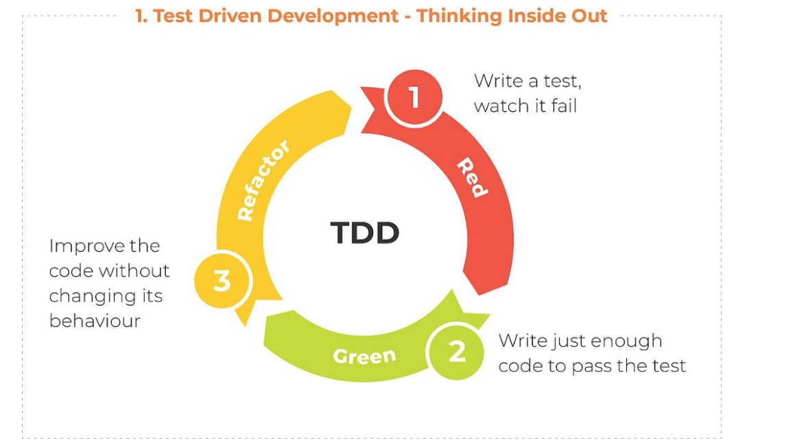
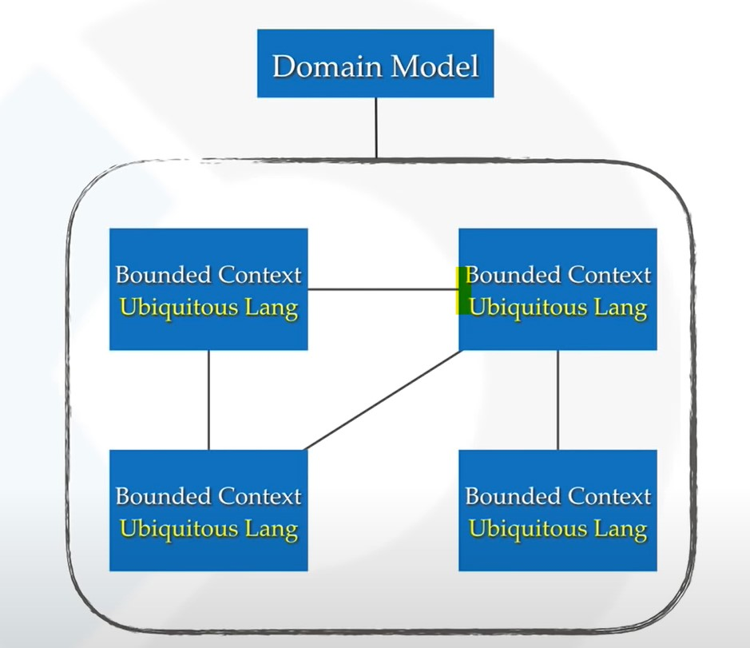

# Maven
- See some videos about maven pom file.

## POM File (Project Object Model)
### Parent
```xml
<parent>
    <groupId>mycompany.trade.com</groupId>
    <artifactId>mycompany.trade.</artifactId>
    <version>1.1.1.0-SNAPSHOT</version>
</parent>
```
- maven reads the parent POM from your local repository (or proxies like nexus) and creates an 'effective POM' by merging the information from parent and module POM.
-  reason to use a parent is that you have a central place to store information about versions of artifacts, compiler-settings etc. that should be used in all modules.

# JUnit
- See how to write test cases in JUnit.
- Test driven code is writing testcase first and then write the code to pass those test cases.

# Testing

## Test Driven Design


## White,Black and Grey box Testing
### White Box
White Box Testing is software testing technique in which internal structure, design and coding of software are tested to verify flow of input-output and to improve design, usability and security.

### Black Box
Knowledge of internal working structure (Code) is not required for this type of testing. Only GUI (Graphical User Interface) is required for test cases.

### Grey Box
Partially Knowledge of the internal working structure is required.


## Cucumber

## Integration Testing
- It focuses mainly on the interfaces & flow of data/information between the modules. Here priority is to be given for the integrating links rather than the unit functions which are already tested.

### Approaches 
#### Big Bang Testing
- all the components or modules are integrated together at once and then tested as a unit.
#### Incremental Testing
- testing is done by integrating two or more modules that are logically related to each other and then tested for proper functioning of the application. 
#### Bottom-up Integration Testing
- Lower level modules are tested first then higher level modules

#### Top-down Integration Testing
- Opposite

#### Sandwitch Testing
- top level modules are tested with lower level modules at the same time lower modules are integrated with top modules and tested as a system.

## Unit Testing

## Smoke Testing

## Performance Testing
### Load testing
- checks the application's ability to perform under anticipated user loads.

### Stress testing
-  involves testing an application under extreme workloads to see how it handles high traffic or data processing. 

### Endurance testing
- is done to make sure the software can handle the expected load over a long period of time.

### Spike testing
-  tests the software's reaction to sudden large spikes in the load generated by users.

### Scalability testing - 
- The objective of scalability testing is to determine the software application's effectiveness in "scaling up" to support an increase in user load.


## Squeeze Testing

## Mock vs Stub
### Stub
-  the biggest distinction is that a stub you have already written with predetermined behavior. So you would have a class that implements the dependency (abstract class or interface most likely) you are faking for testing purposes and the methods would just be stubbed out with set responses. They would not do anything fancy and you would have already written the stubbed code for it outside of your test.
-  a dummy piece of code that lets the test run, but you don't care what happens to it.

### Mock
- A mock is something that as part of your test you have to setup with your expectations. A mock is not setup in a predetermined way so you have code that does it in your test. Mocks in a way are determined at runtime since the code that sets the expectations has to run before they do anything.
- Stubs don't fail your tests, mock can.
- a dummy piece of code, that you VERIFY is called correctly as part of the test.


# JDBC
- JDBC is a standard for connecting to a DB directly and running SQL against it 

# JPA
- Java Persistence API
- JPA is a standard for Object Relational Mapping. The most famous JPA provider is Hibernate. 
- JPA is an specification/interface and Hibernate is an implements of the JPA Specification

## Entity Manager
- Save the Entity to Database

## Persistence Context
- The persistence context is the first-level cache where all the entities are fetched from the database or saved to the database. It sits between our application and persistent storage.
- An EntityManager instance is associated with a persistence context.
- Flushing a Cache is the act of putting modified data back into the database.
- A PersistenceContext is essentially a Cache. It also tends to have it's own non-shared database connection.
### Persistence contexts are available in two types:
- The default persistence context type is PersistenceContextType.TRANSACTION. To tell the EntityManager to use the transaction persistence context, we simply annotate it with @PersistenceContext
#### Transaction-scoped persistence context
- The transaction persistence context is bound to the transaction. As soon as the transaction finishes, the entities present in the persistence context will be flushed into persistent storage.
####  Extended-Scoped Persistence Context
- An EntityManager using an extended persistence context maintains the same persistence context for its entire lifecycle. Whether inside a transaction or not, all entities returned from the EntityManager are managed, and the EntityManager never creates two entity instances to represent the same persistent identity. Entities only become detached when you finally close the EntityManager (or when they are serialized).


## Annotations

@Entitiy
- Store a Java bean to the table then declare the bean with the Entity Annotation.

@Id
- Declare primary key with Id Annotation

@GeneratedValue
- Declare the field decorated by this annotation to have generated value.

@Transactional
- Each method would be involved in a transaction if the class is declared with @Transactional annotation.
- It is used to combine more than one writes on a database as a single atomic operation.
- If you don't specify @Transactional, each DB call will be in a different transaction.
```java
@Repository
@Transactional
public class UserRepository {
    @PersistenceContext
    private EntityManager entityManager;

    public long insert(User user){
        entityManager.persist(user);
        return user.getId();
    }
}

```


@PersistenceContext


# Apache commons
- It has utility classes.

# JMS
- JAVA Messaging Service
## Message Types
- JMSObjectMessage
- JMSTextMessage
- JMSBytesMessage
- JMSStreamMessage
- JMSMapMessage

# Behavior Driven Design
- BDD focuses on defining user stories or scenarios. It is closely related to an incremental process, but it can also be viewed as static: it describes all the interactions between users and the finished system.
- Cucumber (language used is Gherkin) is used for BDD.

# Domain Driven Design
- Eric Evans
- We develop model of the domain/business problem and make our software conform to that.
- When designing our focus shouldn't be on the technology, but on the business or whatever activity we are trying to assist with the  software.
- It's not customer's job to know what they want. Even if architecture is fabulous but the end user decides if the system is good or not.
- Services, Entities, Domain Model, Repositories, Factories are made popular by domain driven design
- DDD focuses on defining the vocabulary in that language: actors, entities, operations, ... An important part of DDD is also that the ubiquitous language can be clearly seen in the code, too, not only in communication between the implementor and the domain expert. So an extreme view of DDD is quite static: it describes the finished system as a whole.


## 2 Types of tools

### Strategic Design Tools
- Everyone who is more experienced will give more importance to strategic design tools.
- Instead of thinking in terms of objects like in OOPs, we think in terms of context (setting in which a word/statement appears, determines it's meaning)
- When given a problem, you talk to domain expert and try to find the core values and motivation behind each feature.

- Shouldn't change during product development.
#### Domain Model
- Aspects chosen for implementation that constitute the model.
- Representation of Bounded Contexts, Domain Model is to Bounded Context, what classes are to objects.

#### Ubiquitous Language
- Developer, Domain Expert, Analyst, everyone and everything should use the same words for same concepts, any 2 people are talking to each other, everyone else should be able to follow. You need to name your classes, code, documentation that way. Don't become more technical that necessary.
- 
#### Bounded Context
- Things hold the same meaning within each bounded context.
- In the following figure, A Customer Concept is different to a Sales Person(Interests, likes, needs) and is different to Support(Purchase History, Tickets etc) and also different for Accounting(Method of Payement, Refunds etc). Each of these are a bounded contexts.
- **Each bounded context needs to have their own Domain Model and Bounded Context, Database, API, User Manual.**
- Design your microservice around bounded context.

#### Context Map
- Relationship between bounded context, API Contracts etc are context map.

#### Event Storming
- Brainstorming workshop between domain experts and developers aimed to attain a common understanding of the domain model and define bounded contexts etc.

### Technical Design Tools
- Concerned with the implementation
- Expected to change within product development.

#### Layered Architecture.
- The heirarchy of Request Handler, Controller to Service Layer and Finally to Repository Layer.
- Everything is organised and well design, reusable components.

#### Value Objects
- Don't use primitive in your code.
- Value enforces ubiqutous language.
- Easily Validate/Limits inside the value itself.
- Helps us avoid Magic Numbers and duplicated code.
- Immutable so thread safe.


#### Entity Object
- Uniquely Identified using ID
- Consists of value objects
- mutable
- represents a row in db.
- generally implements some business logic

