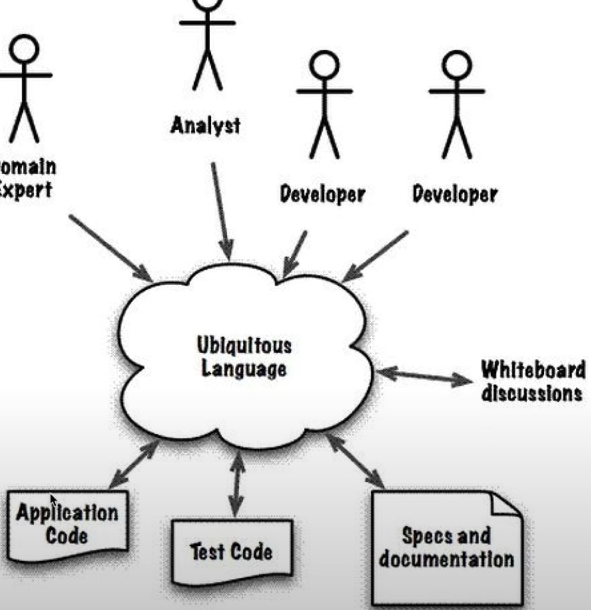

# Maven
- See some videos about maven pom file.

# JUnit
- See how to write test cases in JUnit.
- Test driven code is writing testcase first and then write the code to pass those test cases.

# Domain Driven Design
- Eric Evans
- We develop model of the domain/business problem and make our software conform to that.
- When designing our focus shouldn't be on the technology, but on the business or whatever activity we are trying to assist with the  software.
- It's not customer's job to know what they want. Even if architecture is fabulous but the end user decides if the system is good or not.
- Services, Entities, Domain Model, Repositories, Factories are made popular by domain driven design
## 2 Types of tools

### Strategic Design Tools
- Everyone who is more experienced will give more importance to strategic design tools.
- Instead of thinking in terms of objects like in OOPs, we think in terms of context (setting in which a word/statement appears, determines it's meaning)
- When given a problem, you talk to domain expert and try to find the core values and motivation behind each feature.

- Shouldn't change during product development.
#### Domain Model
- Aspects chosen for implementation that constitute the model.
- Representation of Bounded Contexts, Domain Model is to Bounded Context, what classes are to objects.

#### Ubiquitous Language
- Developer, Domain Expert, Analyst, everyone and everything should use the same words for same concepts, any 2 people are talking to each other, everyone else should be able to follow. You need to name your classes, code, documentation that way. Don't become more technical that necessary.
- 
#### Bounded Context
- Things hold the same meaning within each bounded context.
- In the following figure, A Customer Concept is different to a Sales Person(Interests, likes, needs) and is different to Support(Purchase History, Tickets etc) and also different for Accounting(Method of Payement, Refunds etc). Each of these are a bounded contexts.
- **Each bounded context needs to have their own Domain Model and Bounded Context, Database, API, User Manual.**
- Design your microservice around bounded context.

#### Context Map
- Relationship between bounded context, API Contracts etc are context map.

#### Event Storming
- Brainstorming workshop between domain experts and developers aimed to attain a common understanding of the domain model and define bounded contexts etc.

### Technical Design Tools
- Concerned with the implementation
- Expected to change within product development.

#### Layered Architecture.
- The heirarchy of Request Handler, Controller to Service Layer and Finally to Repository Layer.
- Everything is organised and well design, reusable components.

#### Value Objects
- Don't use primitive in your code.
- Value enforces ubiqutous language.
- Easily Validate/Limits inside the value itself.
- Helps us avoid Magic Numbers and duplicated code.
- Immutable so thread safe.

#### Entity Object
- Uniquely Identified using ID
- Consists of value objects
- mutable
- represents a row in db.
- generally implements some business logic

