- To create a thread you need to create a class( can be anonymous ), inherit the Thread class and overwrite it's run method.
- you need to start the thread explicitly after initializing it. You cannot start the same thread more than once, you need to initialize another thread with same class if you want to run again.
    ```java
        Thread t = new Thread() {
            public void run(){
                System.out.println("Hello from the anonymous class");
            }
        };
    ```

# Threads
- Threads in java are Operating System threads/Native Threads/Kernel Threads.
- Each thread has thread stack, program counter, stack frames.
- Using too many threads decreases performance by context switching and flushing caches repeatedly for each context switch. Data Locality Issue
- There is also a scheduling overhead.
- Lot of IO Operations also result in a lot of blocking operations.
- These 2 problems


# Synchronous/Asynchronous Java API
- Using Completable futures
- Using callbacks and not wait.

# Java Memory Model (Hardware Perspective)
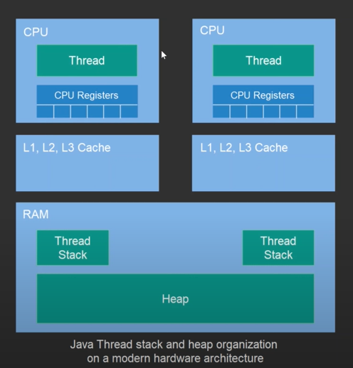
- Let's take the above diagram as an example.
- Two java threads are running in 2 different CPU Core. Each CPU has some registers and cache related to them and there is shared memory i.e RAM.
- When a thread needs some data from thread stack or heap, it has to access the RAM, what happens is the data from RAM is copied to cache and then loaded on to CPU's register.
- Also when the data changes, it has to go from register to cache to RAM.

## Problems
- This model of memory causes some problems we need to be aware of like race condition and data visibility.

### Race condition
- Say T1 is trying to increment obj.count from Heap(RAM) and T2 is also to increment obj.count from Heap.
- Both load up their CPU registers at the same time so both get data obj.count == 1 in CPU registers.
- Both increment the data and the final value ends up being 2 (instead of 3) 
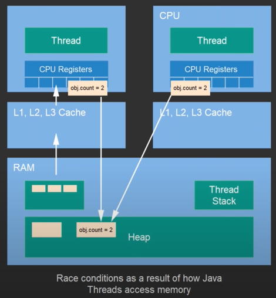

- To avoid this use synchronised keyword or make count volatile.

### Data Visibility
- Say T1 updated the value of count in it's register, and only after than T2 tried to read from heap.
- The JMM doesn't guarantee (by default) that the data updated in register is flushed back to main memory
- So T2 might end up reading a stale value.

- To avoid this use synchronised and volatile keyword.


## Cache coherance strategies
- It is an optimization technique/ strategies in some CPUs.
- Data is written to all the cache across all CPUs before it is written to Main memory
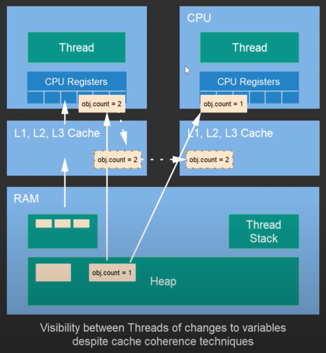
- You still have to use volatile and synchronised if this is enabled since there is no guarantee when the data in registers in flushed back to cache/RAM.

## Instruction Reordering
- CPUs can execute multiple instructions in parallel, if the end outcome is same and it leads to an optimization of run time. 

- In the figure first and 3rd are independent and thus can be run parallely. CPU has some optimizations where it looks ahead and figures out if some instructions can run in parallel.
- **JVM/Compiler to make CPUs job easy can reorder the instructions.** So even if instructions are listed in order, the order of instructions isn't guaranteed. 1st 3rd then 2nd then 4th.


## Volatile Visibility Guarantee
- The above instruction reordering may affect correctness of multi-threaded programs.
- Let's take an example of a GUI application with 2 methods, storeFrame and takeFrame.
- Say these 2 methods are running on 2 separate threads.
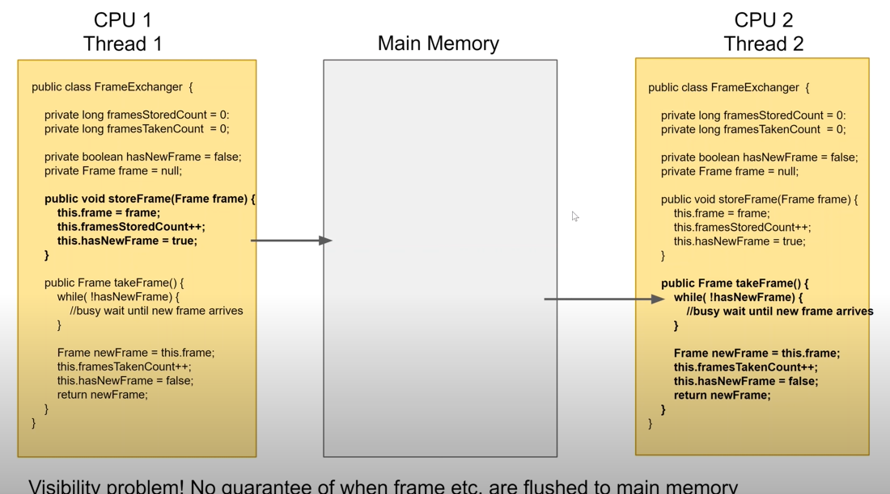
Since the instance variables(frame) has not been declared volatile or the methods are not surrounded by synchronised, there is no guarantee that the frame object in CPU's register is flused to main memory, so we are suffering from visibility problem.
- This problem can be avoided by simply declaring the instance variables as volatile.
- ### Not only all volatile varibles are flushed to main memory on write, they are also read always from main memory, so thread 2 will also read the updated instance variables from main memory.
- However, we don't need to declare all the instance variables as volatile, just last one is enough. This is because of java volatile visibility guarantee.
- ### It says that at the time that you write to a volatile variable, all variables that are visible in register till this point are also written to main memory.
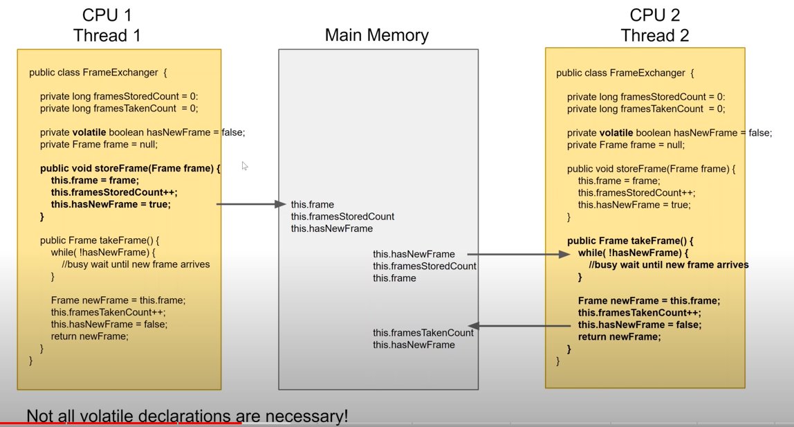
- As can be seen only hasNewFrame has been declared volatile.
- When hasNewFrame is written, all the fields(frame, frameStoredCount and hasNewFrame) are pushed to main memory.
- ### Java volatile visibility guarantee also says that during the time we are reading a volatile variable, all the values of (non-volatile) variables will also be refreshed in the registers.
- So when we load hasNewFrame in CPU 2's register, the non-volatile variables i.e frame and framesStoredCount are also refreshed in CPU 2's registers.


## Volatile Happens before Guarantee

- ### Since frames, frameStoredCount and hasNewFrame are independent of each other, you might think CPU will be free to reorder their execution (which might affect visibility guarantee). But the Java's HAPPENS BEFORE GUARANTEE prevents this instruction reordering from happening.
- ### Any write to a field or variable that happens(in code) before a write to a volatile variable will remain before the write to the volatile variable(in cpu execution), i.e instruction reordering doesn't happen in this case. Same in case of read.

## Synchronised Visibility Guarantee.
- ### When a thread enters a synchronised block, it will refresh all of the values in register and cache from the main memory.
- ### When a thread exits a synchronised block, all values in register will be flushed back to main memory.

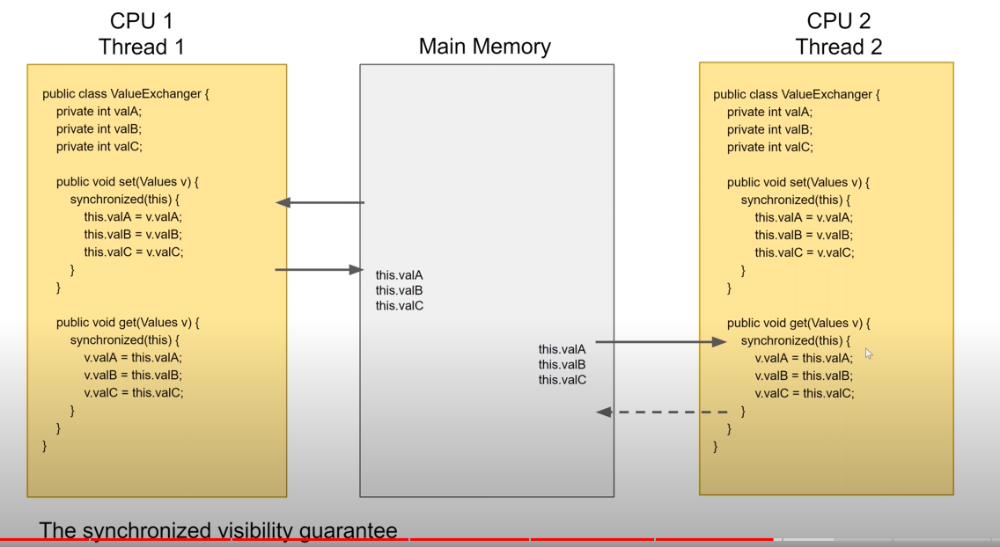

## Synchronised Happens before Guarantee
- ### Any write to a variable that happens before exit of synchronised block is guaranteed to remain before(cannot be reordered) the exit of synchronised block. This also includes the variables that are before the entry of synchronised block. Same for reads in case of entrance to synchronised block.
- Similar to volatile, instruction reordering doesn't happen such that a code in synchronised block comes before or after the synchronised block.
- The following if permitted can break the logic, since now valC may not have been flushed.
- 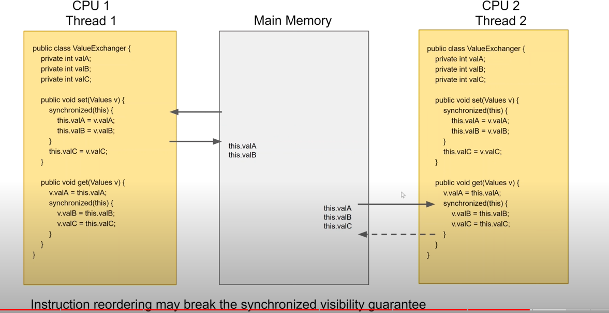


### In summary, Happens before guarantee are a set of instructions to avoid instruction reordering and prevent it from breaking visibility guarantees.


# Synchronised
- ## Monitor object cannot be null
- You should not use literal strings/string constants as monitor objects because of string interning.
    ```java
    synchronised("mon")
    ```

- Monitor object can also be thought of as lock.
- Monitor object can be passed in constructor and shared across multiple threads, such that only one thread can get access of monitor object's lock.
- Java synchronised block are **RENTRANT**, meaning if a thread already has hold of a lock/monitor object, it is allowed to go into blocks which also needs the same monitor object. Execution doesn't stop when you reach b().
  ```java
  public class RentrantExample{

      public synchronised static void a(){
          b();
      }

      public static void b(){
          synchronised(RentrantExample.class){
              ....
          }
      }
  }
  ```
- There is no guarantee about the sequence in which threads get access to synchronised lock, not fair. This can lead to starvation of threads.


- every object in java can be a monitor object, each monitor object has a entry set(all threads waiting to acquire a lock on the object) and a wait set(all threads waiting to get notify called on the object).
  

- Calling notify doesn't give the lock automatically to the notified thread, the owner thread has to release the lock i.e go out of synchronized scope.

## For static methods
- Only one thread can access this per class.
- monitor object is the class.

```java
public static synchronised void setObject(Object O){
    object = O;
}
```

or 

```java
public static void setObject(Object O){
    synchronised(StaticSynchronisedExample.class){
        object = O;
    }
}
```

## For non static methods
- Only one thread can access this per instance.
- There can be multiple threads accessing a non static method in a class (one for each instance).
- "this" is the monitor object.
```java
public synchronised void setObject(Object O){
    object = O;
}
```

or 

```java
public void setObject(Object O){
    synchronised(this){
        object = O;
    }
}
```

## Using both in a class
Say for example
```java
public class MixedSychExample{
    public static Object staticObj = null;
    public Object instanceObj = null;

    public static synchronised setStaticObject(Object o){
        staticObj = o;
    }

    public synchronised setInstanceObject(Object o){
        instanceObj = o;
    }
}
```
### Both the setStaticObject and setInstanceObject can be called by 2 threads parallely, since they have different monitor object. 

### It is useful to use block level scope of synchronized and not do synchrhonised on the entire methods to prevent overhead, in case scope is too large.
```java
public void someMethod() {
    /* non-critical section */
    synchronized(this) {
    /* critical section */
    }
    /* remainder section */
}
```


# Volatile 


# Thread Local
- Use case is to have Per thread instances for memory efficiency and thread safety.
- Say if we want to run a task 1000 times, and we use a thread pool of size 10. This task requires a SimpleDateFormat Object.
- If we move the initialization of this SimpleDateFormatObject inside the task, the program will create 1000 objects. This causes memory issue.
- One solution is to have a single SimpleDateFormatObject globally, but to make the program thread safe we need to have locks which will decrease performace of program.
- The solution is to use middle ground and use ThreadLocal, one instance per thread and across each Runnable, this ThreadLocal instance is shared for all task run by a thread.
- There is never a synchronisation issue, since each thread calls its own copy of instance.


```java
public class ThreadLocalExample2 {
    //Using Anonymous Class
    public static ThreadLocal<SimpleDateFormat> dateFormatter = new ThreadLocal<>(){
        @Override
        protected SimpleDateFormat initialValue() {
            return new SimpleDateFormat("yyyy-MM-dd");
        }
        @Override
        public SimpleDateFormat get() {
            return super.get();
        }
    };
    public static void main(String[] args) {
        ....
    }
    public static String birthDate(int userId){
        Date birthDate = birthDateFromDB(userId);
        final SimpleDateFormat df = ThreadLocalExample2.dateFormatter.get();
        return df.format(birthDate);
    }
}
```

In Java 8 it is even more simple, **using withInitial factory** method
```java

    public static ThreadLocal<SimpleDateFormat> dateFormatter = 
                                ThreadLocal.withInitial(()->new SimpleDateFormat("yyyy-MM-dd")); 
```

## Thread Local for per thread context.
Say, we have a web server, and a request goes through 4 services, and throughout the request we are guaranteed that we deal with the same thread. So instead of passing the user from one service to another, we can use a ThreadLocal<User> such that for this thread, we can get a User Object for any service/task.

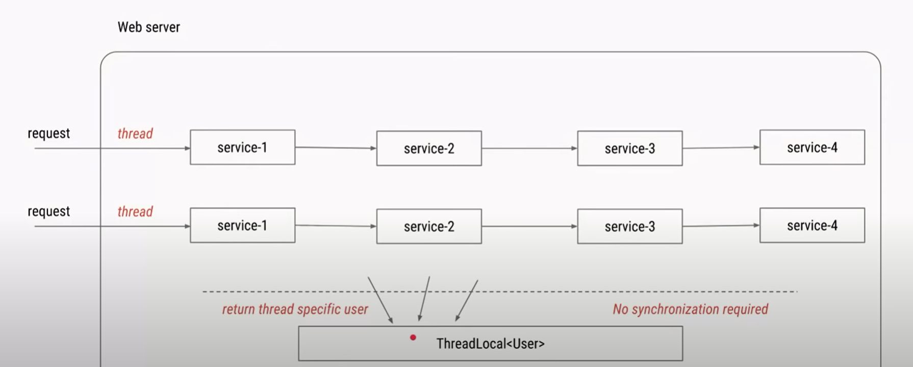
This time we don't know the intial value, so we set the initial value in the service1. And subsequent access of User by other Services can use this set value.
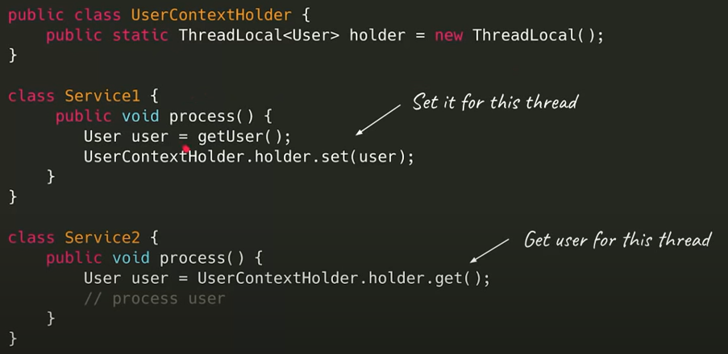


### This concept of ContextHolder and ThreadLocal is used throughout the Spring Framework
- LocaleContextHolder
- TransactionContextHolder
- RequestContextHolder
- SecurityContextHolder
- DateTimeContextHolder

### We need to also ensure once the request is processed, we remove the User Object in Service4 using ```UserContextHHolder.holder.remove()```

# Blocking Queue


# CountDownLatch
 

# Rentrant Lock and Conditions

We can use any object as a lock in synchronised block and use wait and notify inside the synchronised block to communicate between threads and notify the threads.
```java
    public class ObjectLockExample {
        static Object lock = new Object();
        public static void main(String[] args) throws InterruptedException {
            ExecutorService service = Executors.newFixedThreadPool(2);
            service.submit(new Runnable(){
                @Override
                public void run() {
                    synchronized (lock) {
                        try {
                            System.out.println("Waits till enter is pressed");
                            lock.wait();
                        } catch (InterruptedException e) {
                            e.printStackTrace();
                        }
                    }
                }
            });

            service.submit(new Runnable(){
                @Override
                public void run() {
                    synchronized (lock) {
                        System.out.println("Press enter key to proceed");
                        new Scanner(System.in).nextLine();
                        lock.notify();
                        System.out.println("THis has to complete first");
                    }

                }
            });
            service.shutdown();
            service.awaitTermination(10000, TimeUnit.SECONDS);
        }
    }
```

We can also use specialized locks known as rentrant locks and Conditions class to do the exact same thing. Instead of calling wait and notify on the Object (Lock) itself, we call await and signal on Condition Object while using reentrant locks. These specialized locks enable us to place fairness policies and also have other features like tryLock etc.

## While using rentrant locks remember to unlock in the finally block.
## Also remember to lock outside the try block
If we place lock() within the try clause and an unchecked
exception occurs when lock() is invoked (such as OutofMemoryError): The
finally clause triggers the call to unlock(), which then throws the unchecked
IllegalMonitorStateException, as the lock was never acquired

Example
```java
public class ReentrantLockExample {

    static Lock lock = new ReentrantLock();
    static Condition cv = lock.newCondition();

    public static void main(String[] args) throws InterruptedException {
        ExecutorService service = Executors.newFixedThreadPool(2);
        service.submit(new Runnable(){
            @Override
            public void run() throws InterruptedException {
                lock.lock();
                try{             
                    System.out.println("Waits till enter is pressed");
                    cv.await();
                    System.out.println("Lock is acquired again");
                }
                finally{
                    lock.unlock();
                }
            }
        });

        service.submit(new Runnable(){
            @Override
            public void run() throws InterruptedException {
                lock.lock();
                try{
                    System.out.println("Press enter key to proceed");
                    new Scanner(System.in).nextLine();
                    cv.signal();
                    System.out.println("THis has to complete first");
                }
                finally{
                    lock.unlock;
                }
            }
        });
        service.shutdown();
        service.awaitTermination(10000, TimeUnit.SECONDS);
    }
}
```

- ### Rentrant Locks are called rentrant since they allow us to get a lock on the same lock object multiple times, you also need to call the unlock the same number of times. There is a method ```lock.getHeldCount()``` it will return the number of times the lock method was called. 

- Rentrant Locks(explicit lock) also allow locking and unlocking in any scopes in any order. Unlike using synchronised keyword(implicit lock)

## Conditions
- conditional variables are always linked to a lock.
- You can have multiple conditions for a single lock for multiple use-cases.
- ### Each Java monitor is associated with just one unnamed condition variable, and the wait() and notify() apply only to this single condition variable. When a Java thread is awakened via notify(), it receives no information as to why it was awakened.  Condition variables remedy this by allowing a specific thread to be notified.
- You can call ```lock.newCondition();``` multiple times on reentrant lock to get multiple condition variables.
- uses cv1.await() and cv2.signal() instead of wait and notify.
  ```java
  private Lock lock = new RentrantLock();
  private Condition cv1 = lock.newCondition();
  private Condition cv2 = lock.newCondition();
  ```

## DeadLock and tryLock

**Rentrant locks have a method called tryLock**, which can be used to elegantly deal with deadlock situations. Say 2 threads T1 and T2 want to acquire 2 locks l1 and l2. A dead lock occurs when they try to acquire locks in different order than the other thread. T1 acquires l1 first and then l2, T2 acquires l2 first then l1. In such situation if l1 is acquired by T1 and l2 by T2 then the program is in state of deadlock. We can deal with deadlock by trying to acquire both locks together, if not don't acquire any. We do that using the tryLock method of rentrant locks as follows.
### Look at the implementation of acquire locks, it is important. The While true part.

```java
    static Lock l1 = new ReentrantLock();
    static Lock l2 = new ReentrantLock();

    static void acquireLock(Lock l1, Lock l2){
        while(true){
            boolean l1IsLocked = false;
            boolean l2IsLocked = false;
            try{
                l1IsLocked =  l1.tryLock();
                l2IsLocked = l2.tryLock();
            }
            finally {
                if(l1IsLocked && l2IsLocked) return;
                else{
                    if(l1IsLocked) {
                        l1.unlock();
                    }
                    if(l2IsLocked){
                        l2.unlock();
                    }
                }
            }
        }
    }

    public static void main(String[] args) throws InterruptedException {
        Thread t1 = new Thread(new Runnable(){
            @Override
            public void run() {
                acquireLock(l1,l2);
                try {
                    System.out.println("Acquired Both Locks....");
                }
                finally {
                    l1.unlock();
                    l2.unlock();
                }
            }
        });
        Thread t2 = new Thread(new Runnable(){
            @Override
            public void run() {
                acquireLock(l2,l1);
                try {
                    System.out.println("Acquired Both Locks....");
                }
                finally {
                    l1.unlock();
                    l2.unlock();
                }
            }
        });
        t1.start();
        t2.start();
        t1.join();
        t2.join();
    }
```

- You can also use tryLock to not block the thread and try something else if the lock is not available.
```java
boolean lockAcquired = lock.tryLock();
//Not blocked if lock not acquired.
if(lockAcquired){
    try{
        //access resources
    }
    finally{
        lock.unlock
    }
}
else{
    do something else.
}
```
- tryLock doesn't honor fairness, even if fairness is enabled, it will barge-in and acquire the lock.
- You can use timeout parameter in try lock to wait till a specified time to acquire lock, if not acquired by that time continue returning false.
- You can use ```lock.isHeldByCurrentThread()``` to know if the current thread holds the lock.

## Lock Fairness
- by default the lock is unfair.
- When multiple threads try to access a lock, they are put into a wait queue.
- If fairness is enabled, then the lock is acquired based on first come first served basis, the first thread is poped from the queue and is assigned the lock. 
- ```Lock lock = new RentrantLock(true)``` you can enable fairness. Default value is false.
### Barge-in
- When the lock is released, if fairness is disabled(default value), a thread which has just tried to acquire the lock at this time might get the lock, even though threads arriving earlier are the queue so that **we can skip the pushing new thread into queue and popping old thread step** to gain some performance benifit. This however can lead to thread   starvation. 


# V.IMP Signal vs Signal All / notify vs notifyAll
- notify wakes (any) one thread in the wait set, notifyAll wakes all threads in the waiting set.

## notifyAll should be used most of the time. If you are not sure which to use, then use notifyAll, even if uselessly wakes up all the threads even though only one can execute at a time as lock is required for execution. Our while guard will protect us.
- Look at producer/consumer (assumption is a ProducerConsumer class with two methods). IT IS BROKEN (because it uses notify) - yes it MAY work - even most of the time, but it may also cause deadlock - we will see why:
  ```java
  public synchronized void put(Object o) {
    while (buf.size()==MAX_SIZE) {
        wait(); // called if the buffer is full (try/catch removed for brevity)
    }
    buf.add(o);
    notify(); // called in case there are any getters or putters waiting
    }

    public synchronized Object get() {
        // Y: this is where C2 tries to acquire the lock (i.e. at the beginning of the method)
        while (buf.size()==0) {
            wait(); // called if the buffer is empty (try/catch removed for brevity)
            // X: this is where C1 tries to re-acquire the lock (see below)
        }
        Object o = buf.remove(0);
        notify(); // called if there are any getters or putters waiting
        return o;
    }
  ```
## Reason for having while guards -> IMPORTANT
## Perform wait/await in the loop always.
- One problem that having loop solves is spurious wake ups, sometimes even if there was no notify/signal, the thread may wake up. That's why it is important to check the condition and put the thread in wait state again.
- We need a while loop in case we get this situation:
- Consumer 1 (C1) enter the synchronized block and the buffer is empty, so C1 is put in the wait set (via the wait call). Consumer 2 (C2) is about to enter the synchronized method (at point Y above), but Producer P1 puts an object in the buffer, and subsequently calls notify. The only waiting thread is C1, so it is woken and now attempts to re-acquire the object lock at point X (above).
- Now C1 and C2 are attempting to acquire the synchronization lock. One of them (nondeterministically) is chosen and enters the method, the other is blocked (not waiting - but blocked, trying to acquire the lock on the method). Let's say C2 gets the lock first. C1 is still blocking (trying to acquire the lock at X). C2 completes the method and releases the lock. Now, C1 acquires the lock. Guess what, lucky we have a while loop, because, C1 performs the loop check (guard) and is prevented from removing a non-existent element from the buffer (C2 already got it!). If we didn't have a while, we would get an IndexArrayOutOfBoundsException as C1 tries to remove the first element from the buffer!

## Reason for using notify ALL
In the producer/consumer example above it looks like we can get away with notify. It seems this way, because we can prove that the guards on the wait loops for producer and consumer are mutually exclusive. That is, it looks like we cannot have a thread waiting in the put method as well as the get method, because, for that to be true, then the following would have to be true:
```buf.size() == 0 AND buf.size() == MAX_SIZE (assume MAX_SIZE is not 0)```

HOWEVER, this is not good enough, we NEED to use notifyAll. Let's see why ...


Assume we have a buffer of size 1 (to make the example easy to follow). The following steps lead us to deadlock. Note that ANYTIME a thread is woken with notify, it can be non-deterministically selected by the JVM - that is any waiting thread can be woken. Also note that when multiple threads are blocking on entry to a method (i.e. trying to acquire a lock), the order of acquisition can be non-deterministic. Remember also that a thread can only be in one of the methods at any one time - the synchronized methods allow only one thread to be executing (i.e. holding the lock of) any (synchronized) methods in the class. If the following sequence of events occurs - deadlock results:

### Step - 1
- P1 puts 1 char into the buffer
### Step - 2
- P2 attempts put - checks wait loop - already a char - waits

### Step - 3
- P3 attempts put - checks wait loop - already a char - waits
  
### Step - 4
- C1 attempts to get 1 char
- C2 attempts to get 1 char - blocks on entry to the get method
- C3 attempts to get 1 char - blocks on entry to the get method


### Step - 5
- C1 is executing the get method - gets the char, calls notify, exits method
- The notify wakes up P2
- BUT, C2 enters method before P2 can (P2 must reacquire the lock), so P2 blocks on entry to the put method
- C2 checks wait loop, no more chars in buffer, so waits
- C3 enters method after C2, but before P2, checks wait loop, no more chars in buffer, so waits

### Step - 6
- NOW: there is P3, C2, and C3 waiting!
- Finally P2 acquires the lock, puts a char in the buffer, calls notify, exits method

### Step - 7
- P2's notification wakes P3 (remember any thread can be woken)
- P3 checks the wait loop condition, there is already a char in the buffer, so waits.
- NO MORE THREADS TO CALL NOTIFY and THREE THREADS PERMANENTLY SUSPENDED

SOLUTION: Replace notify with notifyAll in the producer/consumer code (above).
### To solve the problem above, you can also have 2 different kind of conditions one for added(added.await/signal) and one for remove(remove.await/signal). It is possible by using rentrant locks and conditions class.

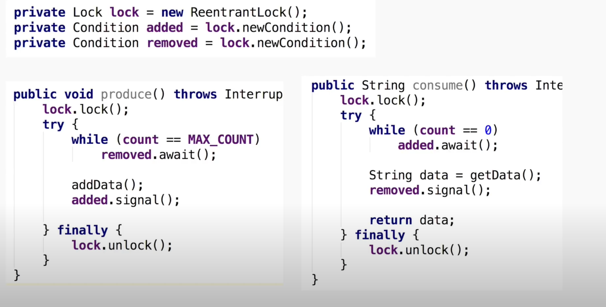

## Additional Points
 
-  If multiple threads are waiting for the notification and we use signal() method then only one thread get the notification and the remaining thread have to wait for further notification. Which thread will get the notification we can’t expect because it totally depends upon the JVM. But when we use signalAll() method then multiple threads got the notification but execution of threads will be performed one by one because thread requires lock and only one lock is available for one object.
-  Condition.signal is fair and will wake up the thread that has been waiting the longest till now.
- In case of mutually exclusive locking, only one of the waiting threads can do something useful after being notified (in this case acquire the lock)


# ReadWriteLock
- We can use readwrite lock to allow multiple threads to read a resources, using rentrant lock will also block reads to the resource. Multiple reader threads and only one writer thread is required. 
- There is one caveat though even though multiple threads can acquire the read lock, while someone is accessing the readlock, no thread can access the write lock, even if they are separate locks. Only one among read/write lock can be acquried at a time.
- We can have either readlock acquired by n threads or a write lock acquired by 1 thread. But never at the same time.
- ## Only write lock can allow newConditions
## Wait Queue for lock in this read write lock.
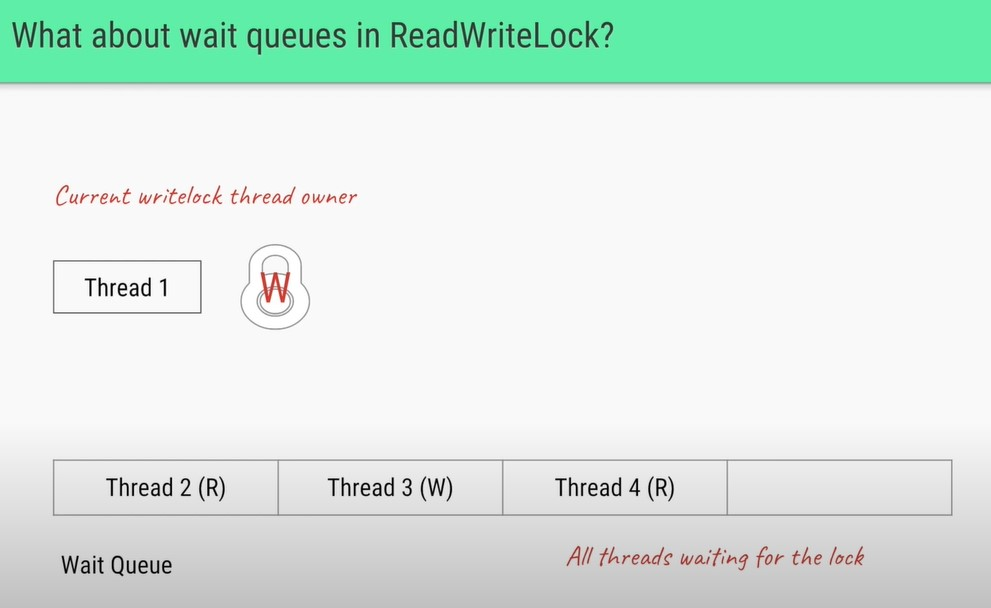
In this case we have 2 types of thread, R and W. Once thread 1 releases lock, both Thread2 and Thread 4 gain access to the lock, since it is more performant to skip Thread 3.
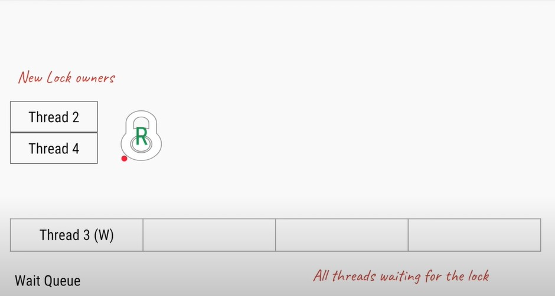

While Thread 2 and 4 are still working on the read lock, if another thread 5 which is a read thread comes in, we can have 2 types of behavior.
  -  Thread 5 can acquire the read lock skipping thread 3 but if a lot of read threads comes, thread 3 can go into starvation.
  -  Thread 3 will acquire the lock, rentrant readwrite lock implements does this case, the thread 5 will wait for thread 3 to complete. 


# Semaphores
- Java api provides a counting semaphore.
- negative values are allowed as initial value of semaphore.
- For more details on semaphore, look at os section.
```java
Semaphore sem = new Semaphore(1);

try {
    sem.acquire();
    /* critical section */
}
catch (InterruptedException ie) { 

}
finally {
    sem.release();
}
```

# Executor Service

- For CPU intensive task, ideal pool size is CPU Core count.
- For IO Intensive task, you can have higher number of threadsm, based on number of IO Operations, and average wait time of thread.
- Too many threads slow down the system due to context switching and also consume a lot of memory

## Types of Pool
- All types uses ThreadPoolExecutor class and pass custom parameters to it.
    ```java
        ThreadPoolExecutor(int corePoolSize,
                       int maximumPoolSize,
                       long keepAliveTime,
                       TimeUnit unit,
                       BlockingQueue<Runnable> workQueue,
                       ThreadFactory threadFactory,
                       RejectedExecutionHandler handler)
    ```
- If your threadPool is at maxCapacity and the queue is also fixedSize task, then the executor service will reject the task, and will take action according to policy defined by  RejectedExecutionHandler.
  - AbortPolicy -> Throws Exceptin
  - DiscardPolicy -> Silently Discard
  - DiscardOldestPolicy -> Discard Oldest Task
  - Caller Runs Policy ->Tells the caller/main thread to execute the task.
    - This slow downs the main thread too.

### FixedThreadPool
- Internally uses LinkedBlockingQueue to keep track of all submitted tasks.
- It uses LinkedBlockingQueue and not ArrayBlockingQueue since the number of tasks are not fixed and can be a large value, linkedlist can add and remove at constant time, unlike array which needs has O(n) in worst case sceanrio.
- Remember thread size is fixed, not the task's size.
- will recreate the thread if thread exits due to exception

### CachedThreadPool
- Internally uses synchronous queue to hold only 1 task. Since number of threads are unbounded and can be till INT_MAX, no need to store the task, just create a new thread if no thread is available.
- If all threads are busy the service creates a new thread.
- if thread is idle for more than 60 seconds then it kills the thread
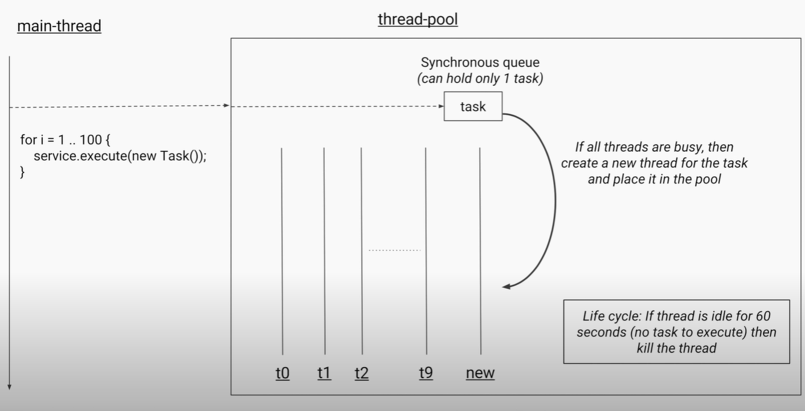


### ScheduledThreadPool
- Uses DelayedWorkQueue. return the task based on wheather the time has passed or not.
- You can schedule a task to run, create tasks at every fixedTimeInterval, or create task at fixedDelay between previous task.


```java
     ScheduledExecutorService service = Executors.newScheduledThreadPool(10);

        service.schedule(()->{
            System.out.println("This is scheduled");
        },2,TimeUnit.SECONDS);

        service.scheduleAtFixedRate(()->{
            System.out.println("This is fixed interval scheduled");
        },1,3,TimeUnit.SECONDS);

        service.scheduleWithFixedDelay(()->{
            System.out.println("This is fixed delay");
        }, 2,2,TimeUnit.SECONDS);
```

### SingleThreadedExecutor
- fixedThreadPool with 1 thread
- uses LinkedBlockingQueue
- will recreate the thread if thread exits due to exception

### CustomThread
- You can create custom executor using ThreadPoolExecutor
- You can use any blocking queue you want even arrayblockingqueue for fixedsize task, if a task is added after the queue is full, a new thread is created.
    ```java
    ExecutorService service = new ThreadPoolExecutor(10,10,1, 
        TimeUnit.MINUTES,
        new ArrayBlockingQueue<Runnable>(10),
        new ThreadPoolExecutor.CallerRunsPolicy());
    ```

## Lifecycle Methods

### Shutdown
- It will just initiate the shutdown, not immediately shutdown, Any new task that is submitted to the service after shutdown are not accepted and will invoke rejectHandler, (Can discard or can abort or caller run), It will complete all the tasks present in queue and thread.
- ```service.isShutdown()``` will return true if shutdown is initiated.
- ```service.isTerminated``` will return true if service has completely shutdown.

### Await Termination
- Tells the main thread to block execution of main thread till all the task submitted are completed or it a certain timeout is exceeded which ever is lower.
  
### shutdownNow()
- Will let the threads currently running, but won't initiate/start any tasks in the queue. It will return all the task in queue in the form of list of runnables.
```List<Runnables> runnables = service.shutDownNow();```

# Callable
## Callable vs Runnable
- If you want to return a value from the thread, you cannot do that if you implement Runnable since it has ```void run()``` method which returns void.
- For this case we have Callable Interface
```java
    class Task implements Callable<Integer>{
        @Override
        public Integer call() throws Exception {
            return new Random().nextInt();
        }
    }
```
- Callable returns a Future

## Future
- Future holds the return value of a callable, it is a holder which will have the return value once the task is completed.
- Calling ```future.get()```  will return the return value of the task if the task is completed, or wait till the task return the value.
     
- ```future.get()``` is a blocking method and will block the caller thread till future is done.

- You need to be careful when processing multiple future in a list, since doing f.get() on first item/placeholder, the main thread will go into block state, even if we have futures which are completed in the list. You can use ```future.isDone()``` to check if an item is completed then try to get it. Another way to deal with it is use timeout in get method. ```future,get(1,TIMEUNIT.MINUTES) // throws TimeoutExeception```.

### Cancel Method
- It can cancel the task, if you call this method on the future, there is a catch though, if the cancel is called on a task which is in queue and is not processed by some thread then that task will be cancelled as expected, but a task that is being processed won't be cancelled. In that case you can use mayInterruptIfRunning flag to attempt to interrupt the thread ```future.cancel(true) //mayInterruptIfRunning : true```. Look at Interrupt in thread.

### Execution Exception


# Fork Join Pool (USED FOR RECURSION)
- ### It implements the Executor Service Interface (just like ThreadPoolExecutor class).

- 2 ways in which it differs from ThreadPoolExecutor:
## Tasks producing subtasks

- It is optimised for the problems where the task can produce their own sub tasks.
- There are 2 operations involved, forking or separating into multiple subtasks, and then later joining these subtask to return the answer.


- Let's take the example of fibonacci sequence, where subtask is fib(n-1) and fib(n-2).

## Per-Thread Queueing
Let's consider the following case, we have 2 threads in our thread pool.
- In ForkJoinPool, each thread has it's own queue, a double-ended queue, known as deque.
- When we fork, the subtasks are not stored in the main queue but in the deque/local queue.
- So leveraging data locality, it becomes easy for the thread to pick up the next task and start solving the task.

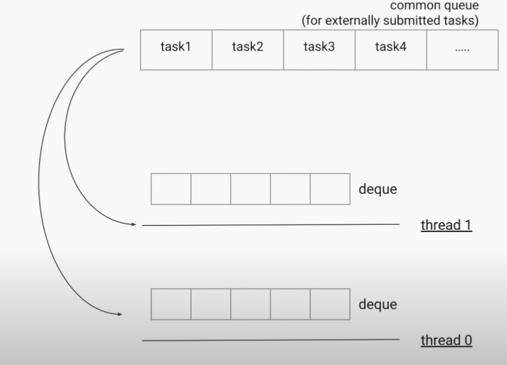
## Work Stealing
- Say thread1 has lots of subtasks in queue, and thread2 is idle, in this case thread2 can take up tasks from thread1's local queue.
- In such cases data synchronisation issues can come up if we use shared data, so be careful.

## Things to keep in mind.
- Avoid synchronisation
- Don't use shared variables across task
- Don't perform Blocking IO Operation
- Task should be isolated
- It can be used in
  - Sorting
  - Matrix Multiplication
  - Tree traversal

## Advantages
- Use-case for this is you want a parallel execution but you want to maximize data locality.
- It is better than just simply executing the entire task in a single time i.e no subtask creation since, if there are free threads they can pick up subtask from local queue(stealing) and lead to parallelism.
- Also since the threads are always busy there are very less context switching between multiple threads.

## Code
- ### We extend the RecursiveTask Interface, which is a thin wrapper of ForkJoinTask. Remember Recursive Task is a abstract class not interface.

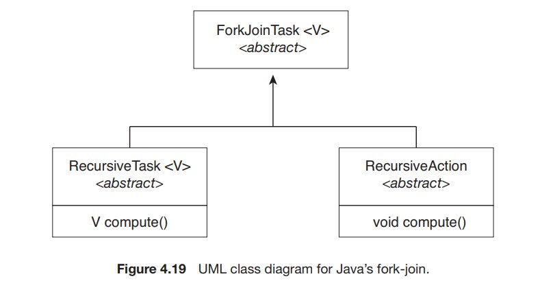

- We overload the compute method.
```java
class FibonacciTask extends RecursiveTask<Integer>{
    final int n;
    final int taskId;
    FibonacciTask(int x, int id){
        taskId = id;
        n = x;
    }
    @Override
    protected Integer compute() {
        System.out.println(taskId + " " + Thread.currentThread().getId());
        if(n == 1 || n == 0) return n;
        FibonacciTask f1 = new FibonacciTask(n-1, taskId);
        f1.fork();
        FibonacciTask f2 = new FibonacciTask(n-2, taskId);
        f2.fork();
        //If there are multiple threads in threadPool, f1 and f2 runs parallely.
        return f1.join() + f2.join();
    }
}
public class ForkJoinPoolExample {
    public static void main(String[] args) throws InterruptedException {
        //Don't use ExecutorService, since submit needs to be overloaded to accept 
        //RecursiveTask.
        //parallelism = Number of processors = 2.
        ForkJoinPool service = new ForkJoinPool(2);
        service.submit(new FibonacciTask(5,1));
        service.submit(new FibonacciTask(5,2));
        System.out.println("This is main thread");
        service.shutdown();
        service.awaitTermination(1, TimeUnit.MINUTES);
    }
}
```
- In above code since we have set parallelism = 2 but also there are 2 tasks,  the execution of a task and it's subtasks(identified by taskId context variable) is performed by the same thread.


## Questions

### Q: Why use ForkJoinPool since one of the thread breaks task into subtask and stores it in it's own deque. In that case there is no parallelism involved but there is over head to break the main task into subtasks and then later joining the results, Aren't we better off just to execute the main task in whole ?

You don't want to execute the main task as a whole, since you can perform fib(n-1) and fib(n-2) parallely. 

There are 2 cases: 
1. Say all threads are busy, if you use ForkJoinPool, even though you don't get parallelism, you still can still leverage data locality benifits, if you don't use forkjoinpool the subtasks might go to different Thread and you don't benifit from data locality. In this case since all threads are busy, there was no way to leverage parallelism so atleast we were able to leverage data locality.


2. Say some threads are idle, and thread1 is busy and has lots of subtasks in it's local queue, other threads can take up these tasks(stealing) from local queue and leverage parallelism (We loose up on data locality but that's okay we get parallelism).

So in both these cases we were able to get some optimization (data locality or parallelism). Thus using ForkJoinPool makes sense.

### Q: How you could use memioization(in fibonacci) to re-use already computed values across the various threads in order to optimize for speed. Avoiding synchronised blocks
- Use Concurrent Hash Maps.

### Q: Why is blocking io intensive task not a good candidate for ForkJoinPool
- Blocking IO is not recommended because ForkJoinPool tries to use limited threads, running on same cores, to take advantage of data locality and is thus faster. If we block the thread because of IO, ForkJoinPool will have to assign a new thread and flush the cache, which will still work but will be slower. In fact, then it is similar to using ExecutorService.

# Completable Futures

## Problem
- Use Future is going to lead to blocking code since doing Future.get() will block the entire code execution in main thread.
- This is especially a problem when you have multiple tasks and we are doing a for loop over the Future.get().
- Even if there are completed futures in the program, if the first future item is not done, our code execution stops on calling the Future.get().


### Dependent Tasks
Let's take the following example. We have a Task Fetch Order and the following dependent Tasks.
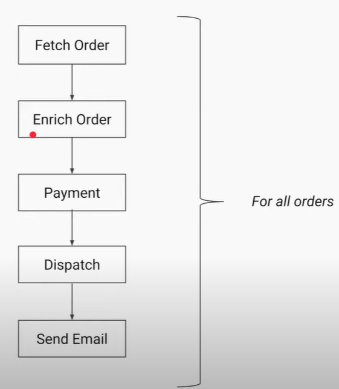
On converting the following to code we have
```java
    ExecutorService service = Executors.newFixedThreadPool(10);
    for(int i =0;i<100;i++){
        Future<Order> future = service.submit(getOrderTask());
        Order order = future.get() //blocking

        Future<Order> future1 = service.submit(enrichTask(order));
        order = future1.get() //blocking

        Future<Order> future2 = service.submit(performPaymentTask(order));
        order = future2.get() //blocking

        Future<Order> future3 = service.submit(dispatchTask(order));
        order = future3.get() //blocking
    }
```
- If the above code is implemented we will not have any sort of parallelism since the second loop/order will only be processed once the first is over, Even if the orders are independent among them.
- This is bad for scaling, we need n threads all processing n orders.
- Within one flow tasks are dependent on each other but one flow is not dependent on another flow.

## Solution
- This is the exact reason why completable future was designed for. We never want the main thread to be blocked. The above code will be simplified to 
```java
    for(int i=0;i<100;i++){
        CompletableFuture.supplyAsync(()->getOrder())
                        .thenApply(order -> enrich(order))
                        .thenApply(order -> performPayment(order))
                        .thenApply(order -> dispatch(order))
                        .thenAccept(order -> sendEmail(order))
    }
```
- In above code the main method is never blocked
- ### The CompletableFuture represents a single independent flow. Such that within one flow tasks are dependent on each other but one flow is not dependent on another flow.
- ### There is no thread management in above code, no executor service, no future.get()

## thenApply vs thenApplyAsync
- thenApply means the same thread will do all the tasks in the same flow. Same thread will do get, enrich, performPayment, dispatch.
- thenApplyAsync, you can pass a thread pool to thenApplyAsync and it will use this threadPool.
- This is useful when you want different pools for cpu bound operation and io bound operation.

```java
    ExecutorService cpuBound = Executors.newFixedThreadPool(4);
    ExecutorService ioBound = Executors.newCachedThreadPool();
    for(int i=0;i<100;i++){
        CompletableFuture.supplyAsync(()->getOrder(), ioBound)
                        .thenApplyAsync(order -> enrich(order), cpuBound)
                        .thenApplyAsync(order -> performPayment(order), ioBound)
                        .thenApplyAsync(order -> dispatch(order), ioBound)
                        .thenAccept(order -> sendEmail(order))
    }
```

## Default Pool
- If we don't supply the executor service, internally the default pool being used is a ForkJoinPool.

## Exception Handling
- If getOrder or enrich or performPayment threw an exception return a failedOrder
```java
    ExecutorService cpuBound = Executors.newFixedThreadPool(4);
    ExecutorService ioBound = Executors.newCachedThreadPool();
    for(int i=0;i<100;i++){
        CompletableFuture.supplyAsync(()->getOrder(), ioBound)
                        .thenApplyAsync(order -> enrich(order), cpuBound)
                        .thenApplyAsync(order -> performPayment(order), ioBound)
                        .exceptionally(e -> new FailedOrder()) // dispatch FailedOrder if exception
                        .thenApplyAsync(order -> dispatch(order), ioBound)
                        .thenAccept(order -> sendEmail(order))
    }
```

## Code Example
- Better way to write and join might exist, need to see.
```java
class WrapperCFExample{
    public int findAccountNumber() {
        int order = 1;
        try {
            Thread.sleep(1000);
        } catch (InterruptedException e) {
            e.printStackTrace();
        }
        return order;
    }
    public int calculateBalance(int x) {
        int balance = 1000 + x;
        try {
            Thread.sleep(1000);
        } catch (InterruptedException e) {
            e.printStackTrace();
        }
        return balance;
    }
    public void notifyBalance(int x)  {
        try {
            Thread.sleep(1000);
        } catch (InterruptedException e) {
            e.printStackTrace();
        }
        System.out.println(Thread.currentThread().getId());
    }
    public void startExample() throws InterruptedException {
        List<CompletableFuture> l = new ArrayList<CompletableFuture>();
        for (int i = 0; i < 10; i++) {
            l.add(CompletableFuture.supplyAsync(this::findAccountNumber)
                    .thenApply(this::calculateBalance)
                    .thenAccept(this::notifyBalance));
        }
        for(CompletableFuture x : l){
            x.join();
        }
    }
}
```

# Asynchronous Programming
## Problem
- Every thread in Java is a native OS thread/kernel thread
- This limits the number of threads you can have in your application.

- If too many threads then we also run into other problems, like flushing cache of old thread and push the data required by new thread, this context switching causes a lot of memory overhead. This is the datalocality issue.
- There is also a scheduling overhead since OS will be busy in scheduling many threads.
- IO operation will cause the thread to be blocked or in the wait state till the IO operation is complete, wasting all the memory to keep the thread alive. This limits the capacity to scale IO operation.

## Solution
- We need non blocking IO operation.
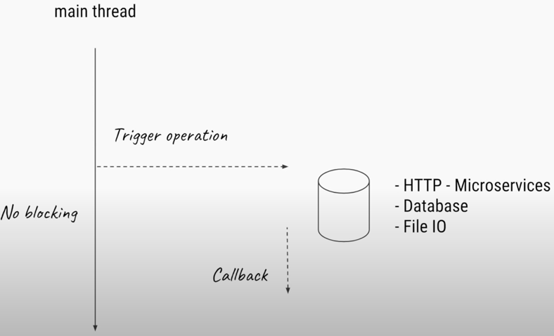
- Have a look at [Video](https://www.youtube.com/watch?v=M3jNn3HMeWg) to understand.
- This article on C# covers the concept pretty well [Link](https://docs.microsoft.com/en-us/dotnet/standard/async-in-depth)