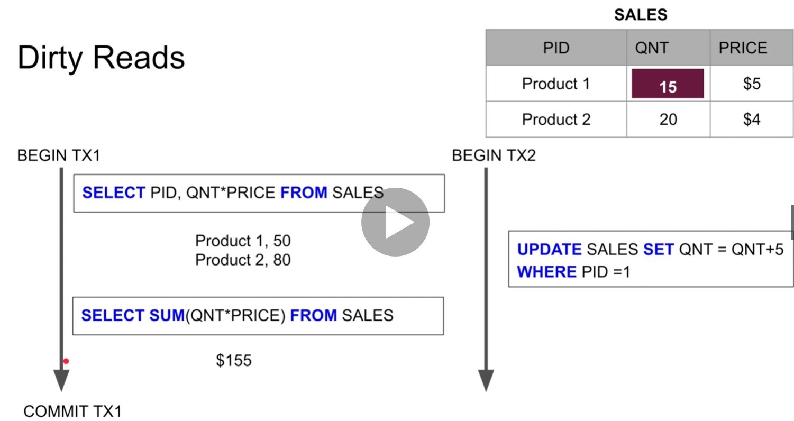
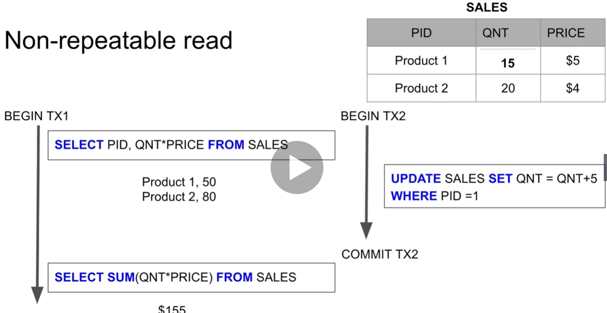
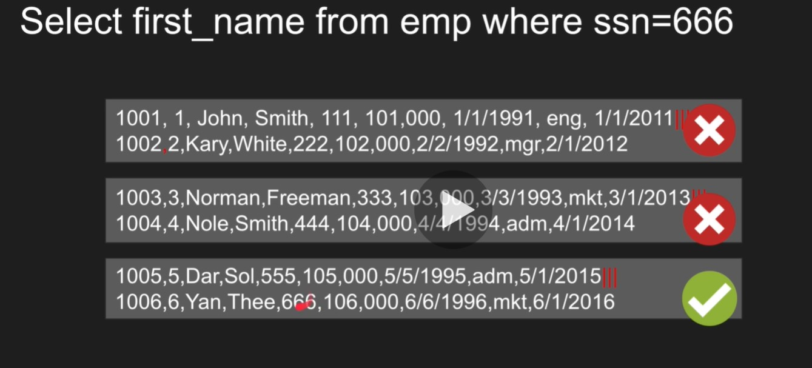
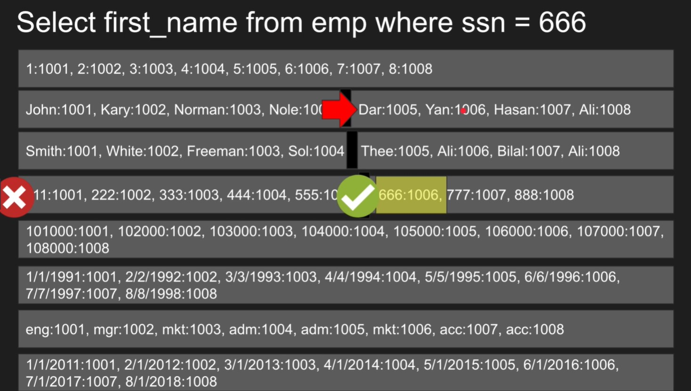
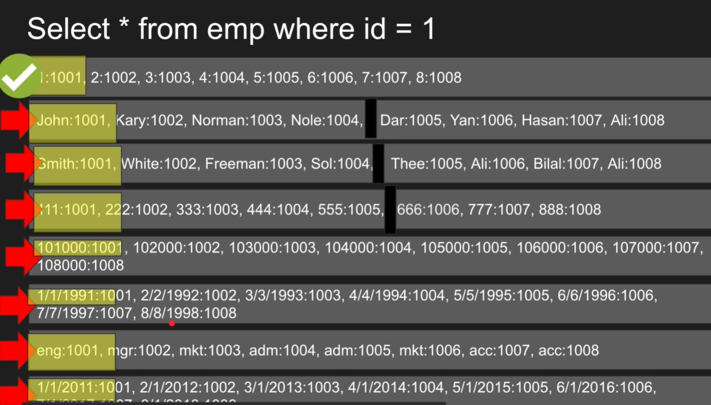
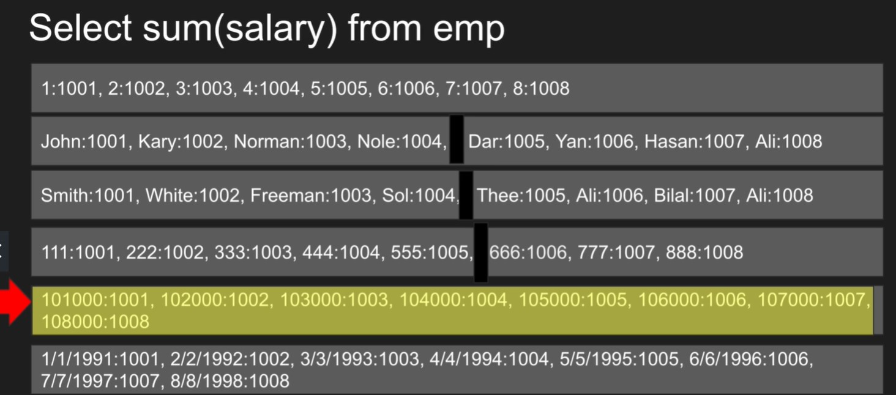

# There is a limit on how many connection can be made to an application
- Theoritically a backend server alone listening on a single port can have unlimited connections, but a tier 2 architecture like using reverse proxy limits total connection to be made since you need a unique client port-server port relation for the tcp connection and there are limited client port in reverse proxy so you have a limit.
- Due to limited ports on the reverse proxy which acts a client for the backend.
- One way to get around is to increase backend servers
- Other way Listen on more than one port in the backend server
- One more way is to use multiplexing on same connection like using http2.

# Head of line blocking problem with HTTP 1.1
Head of Line blocking (in HTTP/1.1 terms) is often referring to the fact that each client has a limited number of TCP connections to a server (usually 6 connections per hostname) and doing a new request over one of those connections has to wait for the previous request on the same connection to complete before the client can make a new request.

# HTTP2 vs HTTP3
- HTTP2 Solves head of line blocking issue at layer 7 by introducing the concept of streams/multiplexing over the same TCP connection multiple request each request with unique stream id. So a client can make multiple requests to a server without having to wait for the previous ones to complete as the responses can arrive in any order
- HTTP2 doesn't solve the head of line blockin issue for Layer 4 TCP protocol due to TCP's congestion control, one lost packet in the TCP stream makes all streams wait until that package is re-transmitted and received. This is because the server has no idea which packet corresponds to what stream at a TCP Level, so it cannot start processing completed requests till all are reached.
## HTTP3
  - HTTP3/QUIC Protocol takes all the good aspects of TCP(Congestion feedback, Loss control), TLS 1.3 and streams from HTTP2 and combines it with UDP.
  -  Unlike TCP and UDP, QUIC is implemented in User Space. Applications can implement QUIC in client application like Google chrome.
  - HTTP2 over TLS has 6 handshakes(4 for TLS and 2 for TCP handshake)
  - QUIC has only 1-2 Handshake.
  - If you loose packets in QUIC, only the stream which lost the packet will be blocked unlike in HTTP2 since UDP doesn't care about order.
  - Unlike in usual protocols with connection ID recognized using ip:port, QUIC has an indepenent connection UUID, so when you switch wifi to mobile network in your cellphones, you can use the same connection.
  - 

# VPN vs Proxy
## VPN
- Makes you part of the VPN Network.
- VPN gives you access to VPN Network's resource.
### Pros
- VPN is layer 2 protocol
- Very slow since multiple hops (you connect to vpn then vpn connects to the destination server).
### Cons
- Double Encryption
- No Caching
- VPN Network's Servers are in same network as you. So they can access your shared resources.

## Proxy
- Protocol Specific
### Pros
- Cachable
- Works at Layer 4 and Layer 7
- Look at the request and tell you and useful for development and debugging
- Used for Load Balancing
  - Service Mesh
  - Varnish HTTP Accelerator

### Cons
- Can see your data.
- They change X-Forwarded For and to, VIA chain header so not anonymous.
- Application can bypass proxy
- Protocol Specific
- Public HTTPs **Terminate TLS Connections** can look at all your HTTPs traffic since they serve you their certificates instead.

# TLS - 1.2 vs 1.3

## TLS 1.2
- Gives option to choose rsa/diffie-helman/eliptical etc..
- You have this 4 http steps before actual sending a single byte.
  - Client Hello (supported algo)
  - Server Hello (use this algo)
  - Change cipher(client-generated-shared-key+encrypted by server's public key)
  - Server fin
- Bad 

## TLS 1.3
- Always communicate keyexchange over diffie-helman.
- Only 2 http steps is required
  - Client hello + send (public key client + public key server + private key client).
  - Server hello + send (public key client + public key server + private key server) 
- Less steps because negotiation for keyexchange protocol is not required.
- TLS 1.3 is more secure because RSA implementations doesn't guarantee perfect forward secrecy or provide with very low encryption grade, thus TLS 1.3 has changed to Diffie Helman.
- Forward secrecy protects past sessions against future compromises of keys or passwords. By generating a unique session key for every session a user initiates, the compromise of a single session key will not affect any data other than that exchanged in the specific session protected by that particular key.

# Synchronous vs Asynchronous vs Multithreading vs Multiprocessing

- Multiprocessing example in morderm times is containerization
- Asynchronous is just non-blocking using callback/async-await. A single thread can be asycnhronous.
- Multithreaded application can be synchronous.

# MQTT vs message Queues
- In message queue a single message is only consumed by one consumer. The load is distributed between all consumers for a queue.
- In MQTT the behavior is quite the opposite: every subscriber that subscribes to the topic gets the message
- A queue is far more rigid than a topic. Before a queue can be used, the queue must be created explicitly with a separate command.
- In contrast, MQTT topics are extremely flexible and can be created on the fly.
- MQTT supports Last-Value-Queue which allows new consumers to quick the old messages and only get latest ones.
- , it is troublesome to use MQTT for the classical long-lived messaging queues. On the other hand, RabbitMQ supports almost all the messaging forms like pub-sub, round-robin, message-queues, etc. It also supports message grouping and idempotent messages. It supports a lot of fine-grain control in terms of accessing queues. 
- MQTT doesn’t support transactions and allows some basic acknowledgments.
- Both RabbitMQ and MQTT are popular and widely used in the industry. You would prefer RabbitMQ when there is a requirement for complex routing, but you would prefer MQTT if you are building an IOT application. 

# Kafka vs Messages Queue
## Pros
- One important distinction is Kafka is based on Long Polling and Message Queue is based on Push, usually long polling is better than pushing because the producer produce at a rate far greater than consumers consume, so it is always good for consumers to pull, long polling is essentially consumer saying, hey if you have some messages please push, else I will wait and keep the connection alive for some time.
- Kafka is Event Driven(microservices with Kafka), Queue(all consumers in one consumer group), PubSub(different consumer groups).
- Fast because it is append only, and offset is like array indices so fast, scales very well zookeeper will just pick up another broker.
- Parallel processing because of partitioning.
- Request is Idempotent.

## Cons
- zookeeper is a single point of failure.
- Whenever kafka rebalances partitions over brokers it becomes unavailable (CAP Theorem).
- Head of line blocking if a particular message is expensive and the entire partition is blocked. 

# We want retries but the request that is retried should be idempotent.
POST requests are the most dangerous in this regard. If I may suggest something, clients should not dictate the primary key such as OrderId. That should be left to the server implementation on how to generate the primary keys for a given entity (it may use sequence, uuids or something else). What clients can do is pass a unique identifier to identify the request, which the server can then use to identify duplicate requests/retries. Stripe uses something called as Idempotency-Key in the request header..
PUT requests benefit from the checksum of the request to avoid the extra network call of update (since, you generally do a GET before a PUT to verify that the row wit the given key exists) and you can verify the checksum after the GET. Flow.io CTO has a very nice presentation of some of these elements - https://www.youtube.com/watch?v=j6ow-UemzBc

# Introduction to Database Engineering.

## Isolation
### Read Phenomena
#### Dirty Read
- One transaction reads a value, which is not yet commited by another transaction.

#### Non Repeatable Reads
- You read a value from a row during the transaction, after some time you read it again, you get a different value (even if you only read a committed value). 

#### Phantom Reads
- Usually observed in range queries, may happen when a new row is inserted or deleted from the table during a transaction is happening

#### Lost Update
- (Not a read phenomena) during a transaction, your update got overwritten by another transaction.

### Isolation Levels to fix Read Phenomena
#### Read uncommited
- No isolation, any changes to databases can be seen by any transaction, leads to dirty reads, non repeatable reads, phantom reads, lost updates.

#### Read commited
- Each query only sees commited stuff, most dbs implement this.
- If another transaction inserts and commits new rows, the current transaction can see them when querying.
- leads to non repeatable reads and phantom reads.

#### Repeatable Read
Uncommitted reads in the current transaction are visible to the current transaction but changes made by other transactions (such as newly inserted rows) won’t be visible.

"Repeatable read" guarantees only that if multiple queries within the transaction read the same rows, then they will see the same data each time. (So, different rows might get snapshotted at different times, depending on when the transaction first retrieves them. And if new rows are inserted, a later query might detect them.)

#### Snapshot Isolation
"Snapshot" guarantees that all queries within the transaction will see the data as it was at the start of the transaction.
- Suffers from phantom read

#### Serializable Reads
- Easiest and slowest level, highest isolation level, no transaction can be run parallel.

## Consistency in reads vs Consistency in data

### Consistency in data
- Weather, the state of the data is consistent, all the schema and relationship hold before and after a transaction, say number of likes should be equal to number of users who liked the data.
- Say if you delete a user, all the posts by those users should be deleted in the same transaction. That is the consistency of data.
- Relational/Traditional Databases/ACID Databases with their ACID Transaction and referrential integrity and cascading deletes achieve this consistency.
- This consistency deals with corrupted data(by say blue screen of death) and the ability to rollback on failure.
- View will always be inconsistent if data is inconsistent.

### Consistency of read ( C in the CAP Theorem)
- On a multi-database architecture, if say we updated a row, the very next read should have the updated value.
- If ACID has to be met, it becomes very expensive to perform write, since all the multiple nodes in the databases and caches needs to have their data synchronized to the updates and inserts(One reason why ACID databases scale badly).
- This is a form of inconsistency that is existing in both relational and non-relational databases. If you can give up ACID (and take up BASE) you can improve writes by having eventual consistency.
- Eventually the follower will take up the updated write.

## Indexing
- Database and index are in 2 different places, database is in separate space(Heap fetches).
- Once fetched we cache the result of the query.
- If there is no index, a database like postgres might spin multiple threads to scan.

### Order of Speed (Higher in list is faster)
- Select Query only has indexed colums/non-key-column enabled indexing + search by indexing (INDEX ONLY SCAN)
- Select Query has attributes other than just index + search by indexing (INDEX SCAN) (Scattered Index Scan)
- No indexing (TABLE SCAN) (Sequential Scan)
- Fuzzy search using like keyword since fuzzy search doesn't use indexing

Sometimes a sequential scan is better than scattered index scan. See Non Key Column below.

### Clustered Indexes and Non Clustered Index
- https://www.youtube.com/watch?v=EZ3jBam2IEA

#### Non Clustered Indexes
- Just points to the data, has the references to the data.
- Can be multiple non clustered indexes in a table.
- PostgreSQL supports only non-clustered index.
- also called secondary indexes

#### Clustered Indexes
- Organizes the data, the data is with the index.
- Can only be one.
- If the attribute used to index is primary key, it is also called primary indexing.

### Non-Key-Column
 
- #### Adding Indexing doesn't always work.
- It might not actually slow down, like in case of INDEX scan, since it might have to scan indexes and then go to fetch from the table since not all the columns in select are in the index. So there are 2 operations.
- To solve this we can include the additional attribute in the index itself.
- https://stackoverflow.com/questions/7362299/how-can-an-index-slow-down-a-select-statement

### Indexing in MySQL vs PostgreSQL
- https://www.youtube.com/watch?v=T9n_-_oLrbM
- MySQL better with updates (Primary key updates are slower)
- PostgresSQL better with reads

## Partitioning
- Breaking the table into multiple tables for easy search via indexes
- Same machine
- Based on a partition keys, or range, or list or hash tables.
- Usually the client which queries the table, are agnostic of these partitions.
### Horizontal Partitioning
- Based on rows
#### Types
- By range (Dates, Ids etc)
- By list (Discrete values all cities with name Gurgaon goes to one partition)
- By hash (Consistent Hashing (Cassandra))

### Vertical Partitioning
- Based on columns
- Almost like normalization
- Say there is a column blob field, which is rarely searched, so there is not point in keeping the blob in expensive ssd, so we can slice the table vertically and keep blob in HDD.

### Pros for Partitioning
- #### Improves query performance when accessing a single partition.
- Easy bulk Loading
- Faster Table Scan
- #### Archive old data that is barely accessed into the cheap HDD Storage.

### Cons for Partitioning
- Updating rows that move from one partitions to another partition is slow.
- Inefficient queries might access all the partitions resulting in slow performance than having a single table.

## Partitioning vs Sharding
- Horizontal Partitioning splits database into multiple tables in the same database, client is agnostic.
- Sharding splits database into multiple tables across **multiple database servers - different ip address**. Client is aware mostly . Useful for distributed processing and latency issues. California customer are gonna put customer data in a database server in california.

## Table Scan Optimzation
- Using multiprocessing/ multithreading.

## Database Engines
- MySQL is one of the few DBs which can change their DB Engines.
- PostgreSQL can't.

## Row Based Vs Column Based Databases (VIMP)

### Storage in DISK
#### ROW Based
- Tables are stored as rows first in disk.
- A single block io read fetches multiple rows with all it's columns.
- Table Scan would require a lot of IO accesses but once the desired row is found, all the columns for the row is found.
- 
- Very good for OLTP (Online Transaction Processing)

### COLUMN BASED
- Tables are stored as columns first in disk.
- A single block io read fetches multiple columns with all matching rows.
- Working with multiple columns would require lots of IO Operations.
- Great for OLAP. (Online Analytical Processing)
- 
- As can be seen above, row-id (invisible to user mostly), is duplicated across all the columns/blocks.
- Editing(deletes) and writes are very slow.

### Performance in selecting a single column
#### ROW BASED
- Assuming no indexes and a full table scan
- Would require multiple IO accesses till desired block is found.

#### COLUMN BASED
- Very fast.
- DB has some idea which block has the required column for which row id.
 
- The above required just 2 IO ops.

### Performance in selecting all the columns/multiple columns
#### ROW BASED
- Same as the one with single column, same latency since all the desired columns are contiguos.
#### COLUMN BASED
- Very bad, since we have to scan multiple blocks to get all information.
- causes too much thrashing (too much time spent on pagination)

### Performance in Aggregation like SUM(column)
#### ROW Based
- would require, scanning the entire blocks related to tables.
- Very bad for analytics and OLAP (Online Analytical Processing).

#### COLUMN Based
- Very Optimized for this use-case

### COMPRESSION
- If multiple people have same salary, we can just append the row_id of the person at the end of the same salary integer like appending to list, this saves up a lot of space, this can't be done in row based since each block has non related data (in terms of types).

### PROS and CONS
- 